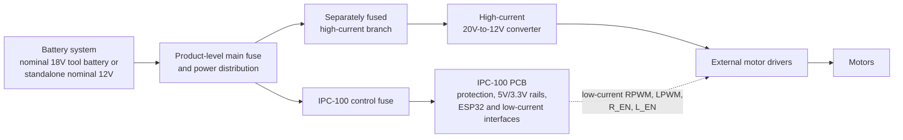
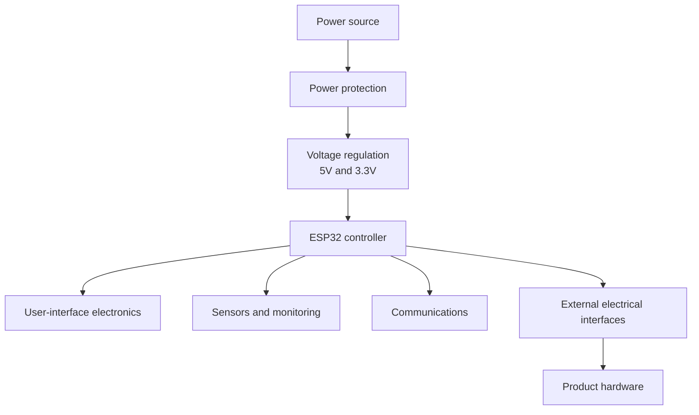

# IPC-100 System Architecture

| Document control | Value |
| --- | --- |
| Document title | IPC-100 System Architecture |
| Purpose | Define the complete platform architecture and responsibility boundaries |
| Platform | Iron Pine IPC-100 |
| Hardware revision | Rev A |
| Blueprint revision | Blueprint v1.0 |
| Document status | Architecture and requirements definition |
| Last updated | TBD |
| Author | TBD |
| Owner | Iron Pine Outdoors Engineering |

## 1. Document purpose

This document defines the system boundaries, functional decomposition, interfaces, and integration model for IPC-100 Rev A. It is the architecture baseline for requirements, schematic capture, PCB design, firmware interfaces, and controller-level verification.

## 2. Mission

IPC-100 is a reusable ESP32-based outdoor controller platform. It provides common control, communications, sensing, user-input, indication, protected power, and low-current external interfaces without incorporating product-specific mechanics or high-current motor power.

CrossWind is the first planned application. It is maintained in a separate external product repository.

## 3. Platform boundaries

### 3.1 On the IPC-100 PCB

- ESP32-family controller module; ESP32-WROOM-32E is the current reference candidate
- USB-C programming and diagnostics interface
- Wide-input power protection and regulation
- 5 V and 3.3 V logic rails
- Battery-voltage monitoring
- Isolated dry-contact relay
- Two motor-driver logic interfaces
- Four product-neutral directional motion-limit interfaces
- Local monochrome graphical I2C OLED interface; 2.42-inch SSD1309 is the reference implementation
- I2C environmental-sensor interface for temperature, relative humidity, and barometric pressure; BME280 is the reference implementation
- Rotary-encoder interface and push-button input
- Dedicated ARM, FIRE, and STOP inputs
- RGB status output
- Buzzer output
- I2C expansion
- Spare GPIO
- Future CAN and RS485 provisions

### 3.2 Off the IPC-100 PCB

- Product-level tool-battery or standalone 12 V battery mount
- Product-level main fuse and high-current distribution
- High-current 20 V-to-12 V converter
- BTS7960 or other motor-driver modules
- Motors and thrower hardware
- Product wiring harness
- Product enclosure
- Moving-platform junction hardware
- Product-specific user-interface enclosure

These off-board items are owned by each product repository and are not part of IPC-100.

## 4. System block diagram

### 4.1 Layered platform view

The following view shows functional dependency rather than physical current flow. Product hardware consumes controlled IPC-100 interfaces; it does not become part of the platform.

## 5. Functional architecture

| Function | IPC-100 responsibility | Product responsibility |
| --- | --- | --- |
| Processing | ESP32-family module, reset/boot/recovery support, base firmware interfaces | Product behavior and configuration |
| Power | Accept protected 9–21 V DC during normal operation; generate 5 V and 3.3 V | Battery mount, main fuse, distribution, actuator power |
| Motor control | Two product-neutral low-current command and enable channels; BTS7960-style signaling is the reference contract only | Driver module, motor power, motors, high-current distribution, motion behavior, speed, acceleration, homing, braking, and mechanics |
| Relay | Isolated NC/COM/NO dry contacts and hardware-safe de-energized control | External load source, current, fuse, load wiring, and firing or trigger sequence |
| Human interface | Product-neutral electrical interfaces for four directional limits, rotary encoder, dedicated ARM/FIRE/STOP controls, a nominal 128x64 monochrome OLED, reusable RGB channels, and reusable buzzer output | Switch and control types, labels, operator workflow, motion interpretation, application recovery, screens, status meanings, audible patterns, panel, enclosure, legends, and ergonomics |
| Sensors | Environmental temperature/humidity/pressure and battery-sense interfaces | Product-level interpretation, placement validation, and environmental strategy |
| Communications | Wi-Fi, Bluetooth, ESP-NOW; future wired provisions | Network topology and product integration |

## 6. Power domains

| Domain | Nominal level | Scope | Notes |
| --- | --- | --- | --- |
| `VIN_RAW` | 9–21 V DC normal operation | IPC-100 input only | Transient-survival profile and protection topology TBD |
| `+5V` | 5 V | On-board and limited interface loads | Final regulator TBD |
| `+3V3` | 3.3 V | ESP32 and logic | Final regulator TBD |
| USB VBUS | 5 V nominal | Programming/diagnostics interface | Backfeed prevention locked; implementation and USB-only behavior TBD |
| External high-current | Product-defined | Off-board only | Must not pass through IPC-100 |

## 7. External interfaces

The preliminary connector set is J1 through J13. Stable signal names, directions, domains, and preliminary pin reservations are defined in [Connector Specification](../connectors/Connector_Specification.md). Physical connector families and enclosure feedthroughs remain TBD.

### 7.1 Communications philosophy

Wi-Fi, Bluetooth, and ESP-NOW are baseline platform capabilities exposed through reusable services. Product firmware selects and configures pairing flows, message semantics, network topology, and application behavior. Physical controls and hardware-safe output states must not depend on a wireless link.

Future CAN and RS485 are expansion provisions only. Rev A does not require populated transceivers, production connectors, or active CAN/RS485 firmware.

## 8. Firmware responsibility boundary

IPC-100 base firmware will own hardware-safe output initialization, logical output abstraction, reusable device drivers and output services, command validation, diagnostics, and platform communication services. Product repositories own motion sequencing, speed and acceleration, homing, braking, firing or trigger sequences, status meanings, audible patterns, user workflows, product safety logic above the platform boundary, and product configuration.

Base firmware must not assume that CrossWind-specific hardware is connected.

### 8.1 Hardware abstraction

The hardware-abstraction layer should expose stable logical capabilities instead of product names or direct register assumptions. It should isolate application code from GPIO assignments, active polarity, device-driver details, hardware revision differences, and optional peripheral population.

The four directional limit names describe platform interfaces rather than physical mechanics. Product repositories map them to actual axes, mechanisms, directions, and endpoints. `ARM_IN`, `FIRE_IN`, and `STOP_IN` remain dedicated physical interfaces; `STOP_IN` is independent of wireless, display, encoder, and optional expansion functions.

### 8.2 Processor-selection boundary

ESP32 remains the approved processor family. ESP32-WROOM-32E is the current reference candidate, not the locked production module. Final module selection depends on:

- Sufficient usable GPIO and resolution of boot-strapping constraints
- Program memory, runtime memory, and nonvolatile-storage needs
- USB architecture
- Peak and average power demand
- Availability and lifecycle suitability
- Antenna keepout, grounding, enclosure clearance, and radio performance

Module selection requires approval before schematic release. Memory capacities, GPIO assignments, antenna dimensions, and enclosure clearances remain `TBD`.

### 8.3 USB service architecture

USB-C is the locked external programming and diagnostics interface. Native USB versus an external USB-to-UART implementation remains `TBD`; no bridge component is selected.

### 8.4 Firmware architecture overview

| Layer | Responsibility |
| --- | --- |
| Boot and board initialization | Establish hardware safe states, clocks, rails, reset behavior, and diagnostics |
| Board support | Pin allocation, revision identification, and low-level peripheral configuration |
| Reusable drivers | OLED, environmental sensor, inputs, relay, RGB, buzzer, battery monitoring, and communications |
| Platform services | Events, diagnostics, configuration, health reporting, and communication abstractions |
| Product application | Product workflows, motion sequencing, user experience, and product-level safety logic |

Only the first four layers belong in the IPC-100 repository. Product application code belongs in the consuming product repository.

Base firmware shall initialize hardware-safe relay, motor, RGB, and buzzer outputs and make safety-relevant stop and motion-limit inputs available before nonessential communication, USB service, display, sensor, encoder-interface, optional-expansion, and product-application services. Relay and motor-enable commands require validated platform state. `STOP_IN` takes priority over motor commands, and applicable limits inhibit commands toward asserted limits. Communication loss or failure must not defeat safe states or leave motion or relay commands active indefinitely. Detectable input and output faults shall be reported through base diagnostics where hardware supports detection. Command validity, timeout, stale-command handling, and arbitration remain `TBD`.

The display and environmental-sensor drivers shall remain reusable and product-neutral. Display refresh, contrast, burn-in mitigation, startup, and low-power behavior remain `TBD`. Environmental sampling, filtering, calibration, and validity rules remain `TBD`. I2C operations, including faults on optional expansion wiring, must not delay or defeat hardware-safe output initialization; timeout and bus-recovery strategies remain `TBD`.

## 9. Product integration model

A product consumes a released IPC-100 hardware revision, connector definition, GPIO contract, and compatible base-firmware interface. The product repository defines external circuits, harnesses, mechanics, enclosures, application firmware, and product-level verification.

## 10. Fault-containment philosophy

- Motor power and motor fault energy remain outside IPC-100.
- External high-current branches are independently fused.
- Relay contacts are isolated from controller logic, receive external load power only, and default with `RELAY_NO` open while the coil is de-energized.
- Motor-driver controls must have hardware-defined disabled states during reset, boot, brownout, firmware failure, loss of power, and uninitialized operation.
- Motor drivers, motor power, motors, and high-current distribution remain product responsibilities; motor current never passes through IPC-100.
- STOP and applicable directional limits take priority over motion commands independently of wireless, display, sensor, or optional expansion services.
- RGB and buzzer outputs are reusable indicators with hardware-safe defaults; product repositories define their meanings and patterns.
- Board-level field inputs require approved protection, conditioning, filtering, and biasing. Exact voltage domains, field-contact assumptions, protection components, and filter values remain `TBD`.
- Input hardware must establish safe defined states during reset, boot, disconnected wiring, and detectable faults.
- STOP is a dedicated physical input independent of wireless, display, encoder, ARM, FIRE, and optional expansion functions.
- Safety-relevant stop and motion-limit inputs take priority over nonessential services where practical, and detectable input faults are available to base diagnostics.
- Wireless control is supplemental and is not the sole means of reaching a safe state.
- Faults on expansion interfaces should not defeat core controller operation where practical.

## 11. Serviceability philosophy

Connectors should be locking, polarized, labeled, accessible, and replaceable where practical. Pin 1, polarity, voltage domains, relay contacts, and test points must be visibly marked. USB and diagnostic test points must remain accessible in the controller service configuration.

## 12. Expansion philosophy

Rev A provides shared I2C and spare GPIO. The OLED, environmental sensor, and optional expansion may share I2C only after address compatibility, bus loading, pull-up ownership, supply domains, cable assumptions, fault behavior, startup, and recovery are verified. External I2C expansion must not become a dependency for establishing hardware-safe outputs.

Future CAN, RS485, and daughterboard compatibility should be preserved where practical without committing unverified transceivers or connector families. Expansion loads must remain within the approved power budget.

## 13. Environmental assumptions

IPC-100 is intended for outdoor equipment installed within a product-level enclosure targeting IP65. Environmental-sensor readings are controller-enclosure measurements by default; they shall not be represented as true external ambient conditions without product-level validation. Locking connectors and production conformal coating are anticipated. PCB operating-temperature limits are TBD. Product repositories own condensation management, drip loops, cable entry, enclosure validation, and final ingress performance.

Display or environmental-sensor absence, initialization failure, or loss of response must not defeat hardware-safe operation or core service diagnostics. Exact fault reporting and product user-interface behavior remain outside this architecture.

## 14. Rev A scope

Rev A covers architecture definition, requirements, protected power entry, logic rails, ESP32 processing, USB diagnostics, universal interfaces, controller mechanics, and controller-level test planning. Component and GPIO selections remain subject to schematic review.

## 15. Out-of-scope items

- Product-specific behavior or documentation
- Battery mounts and adapters
- Product main fuse and high-current distribution
- High-current converters and motor drivers
- Motors, throwers, and motion mechanics
- Product harnesses and enclosures
- Moving-platform junction hardware
- Product certification claims

## 16. Open design questions

| ID | Question | Status |
| --- | --- | --- |
| ARC-TBD-001 | Which reverse-polarity and transient-protection topology meets the final profile? | TBD |
| ARC-TBD-002 | Which 5 V and 3.3 V regulators meet electrical and thermal requirements? | TBD |
| ARC-TBD-003 | Which connector families meet vibration, service, and enclosure requirements? | TBD |
| ARC-TBD-004 | What are the final ESP32 GPIO allocations and boot-safe circuits? | TBD |
| ARC-TBD-005 | What PCB operating-temperature range will be required? | TBD |
| ARC-TBD-006 | Which CAN and RS485 provisions are populated on Rev A? | TBD |
| ARC-TBD-007 | How is USB power isolated from the main 5 V rail? | TBD |

## 17. Related documents

- [Executive Summary](Executive_Summary.md)
- [Platform Vision](Platform_Vision.md)
- [Product Boundaries](Product_Boundaries.md)
- [Design Philosophy](Design_Philosophy.md)
- [Non-Goals](Non_Goals.md)
- [Hardware Requirements](../requirements/Hardware_Requirements.md)
- [Functional Requirements](../requirements/Functional_Requirements.md)
- [Non-Functional Requirements](../requirements/Non_Functional_Requirements.md)
- [Connector Specification](../connectors/Connector_Specification.md)
- [GPIO Map](../connectors/GPIO_Map.md)
- [Power Architecture](../power/Power_Architecture.md)
- [Design Decisions](Design_Decisions.md)
