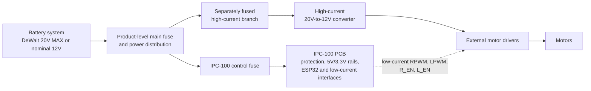

# IPC-100 System Architecture

| Document control | Value |
| --- | --- |
| Document title | IPC-100 System Architecture |
| Platform | Iron Pine IPC-100 |
| Hardware revision | Rev A |
| Document status | Architecture and requirements definition |
| Last updated | 2026-07-28 |
| Owner | Iron Pine Outdoors Engineering |

## 1. Document purpose

This document defines the system boundaries, functional decomposition, interfaces, and integration model for IPC-100 Rev A. It is the architecture baseline for requirements, schematic capture, PCB design, firmware interfaces, and controller-level verification.

## 2. Mission

IPC-100 is a reusable ESP32-based outdoor controller platform. It provides common control, communications, sensing, user-input, indication, protected power, and low-current external interfaces without incorporating product-specific mechanics or high-current motor power.

CrossWind is the first planned application. It is maintained in a separate external product repository.

## 3. Platform boundaries

### 3.1 On the IPC-100 PCB

- ESP32 controller
- USB-C programming and diagnostics interface
- Wide-input power protection and regulation
- 5 V and 3.3 V logic rails
- Battery-voltage monitoring
- Isolated dry-contact relay
- Two motor-driver logic interfaces
- Four limit-switch interfaces
- 2.42-inch SSD1309 OLED interface
- BME280 interface
- Rotary-encoder interface and push-button input
- Dedicated ARM, FIRE, and STOP inputs
- RGB status output
- Buzzer output
- I2C expansion
- Spare GPIO
- Future CAN and RS485 provisions

### 3.2 Off the IPC-100 PCB

- DeWalt battery mount
- Product-level main fuse and high-current distribution
- High-current 20 V-to-12 V converter
- BTS7960 or other motor-driver modules
- Motors and thrower hardware
- Product wiring harness
- Product enclosure
- Moving-platform junction hardware
- Product-specific user-interface enclosure

These off-board items are owned by each product repository and are not part of IPC-100.

## 4. System block diagram

## 5. Functional architecture

| Function | IPC-100 responsibility | Product responsibility |
| --- | --- | --- |
| Processing | ESP32 module, reset/boot support, base firmware interfaces | Product behavior and configuration |
| Power | Accept protected 9–21 V DC; generate 5 V and 3.3 V | Battery mount, main fuse, distribution, actuator power |
| Motor control | Low-current command and enable signals | Driver module, motor power, motor, mechanics |
| Relay | Isolated NC/COM/NO contacts | External load power, fuse, load wiring |
| Human interface | Electrical interfaces for controls, OLED, RGB, buzzer | Product panel, enclosure, legends, ergonomics |
| Sensors | BME280 and battery-sense interfaces | Product-level sensor placement and environmental strategy |
| Communications | Wi-Fi, Bluetooth, ESP-NOW; future wired provisions | Network topology and product integration |

## 6. Power domains

| Domain | Nominal level | Scope | Notes |
| --- | --- | --- | --- |
| `VIN_RAW` | 9–21 V DC | IPC-100 input only | Protection topology TBD |
| `+5V` | 5 V | On-board and limited interface loads | Final regulator TBD |
| `+3V3` | 3.3 V | ESP32 and logic | Final regulator TBD |
| USB VBUS | 5 V nominal | Programming/diagnostics interface | Backfeed prevention TBD |
| External high-current | Product-defined | Off-board only | Must not pass through IPC-100 |

## 7. External interfaces

The preliminary connector set is J1 through J13. Stable signal names, directions, domains, and preliminary pin reservations are defined in [Connector Specification](../connectors/Connector_Specification.md). Physical connector families and enclosure feedthroughs remain TBD.

## 8. Firmware responsibility boundary

IPC-100 base firmware will own board initialization, safe GPIO defaults, hardware abstraction, reusable device drivers, diagnostics, and platform communication services. Product repositories own motion sequencing, thrower behavior, user workflows, product safety logic above the platform boundary, and product configuration.

Base firmware must not assume that CrossWind-specific hardware is connected.

## 9. Product integration model

A product consumes a released IPC-100 hardware revision, connector definition, GPIO contract, and compatible base-firmware interface. The product repository defines external circuits, harnesses, mechanics, enclosures, application firmware, and product-level verification.

## 10. Fault-containment philosophy

- Motor power and motor fault energy remain outside IPC-100.
- External high-current branches are independently fused.
- Relay contacts are isolated from controller logic and fail open on loss of board power.
- Motor-driver controls must default to disabled during reset, boot, and uninitialized firmware states.
- Field inputs require noise and ESD protection.
- STOP is a dedicated physical input.
- Wireless control is supplemental and is not the sole means of reaching a safe state.
- Faults on expansion interfaces should not defeat core controller operation where practical.

## 11. Serviceability philosophy

Connectors should be locking, polarized, labeled, accessible, and replaceable where practical. Pin 1, polarity, voltage domains, relay contacts, and test points must be visibly marked. USB and diagnostic test points must remain accessible in the controller service configuration.

## 12. Expansion philosophy

Rev A provides shared I2C and spare GPIO. Future CAN, RS485, and daughterboard compatibility should be preserved where practical without committing unverified transceivers or connector families. Expansion loads must remain within the approved power budget.

## 13. Environmental assumptions

IPC-100 is intended for outdoor equipment installed within a product-level enclosure targeting IP65. Locking connectors and production conformal coating are anticipated. PCB operating-temperature limits are TBD. Product repositories own condensation management, drip loops, cable entry, enclosure validation, and final ingress performance.

## 14. Rev A scope

Rev A covers architecture definition, requirements, protected power entry, logic rails, ESP32 processing, USB diagnostics, universal interfaces, controller mechanics, and controller-level test planning. Component and GPIO selections remain subject to schematic review.

## 15. Out-of-scope items

- Product-specific behavior or documentation
- Battery mounts and adapters
- Product main fuse and high-current distribution
- High-current converters and motor drivers
- Motors, throwers, and motion mechanics
- Product harnesses and enclosures
- Moving-platform junction hardware
- Product certification claims

## 16. Open design questions

| ID | Question | Status |
| --- | --- | --- |
| ARC-TBD-001 | Which reverse-polarity and transient-protection topology meets the final profile? | TBD |
| ARC-TBD-002 | Which 5 V and 3.3 V regulators meet electrical and thermal requirements? | TBD |
| ARC-TBD-003 | Which connector families meet vibration, service, and enclosure requirements? | TBD |
| ARC-TBD-004 | What are the final ESP32 GPIO allocations and boot-safe circuits? | TBD |
| ARC-TBD-005 | What PCB operating-temperature range will be required? | TBD |
| ARC-TBD-006 | Which CAN and RS485 provisions are populated on Rev A? | TBD |
| ARC-TBD-007 | How is USB power isolated from the main 5 V rail? | TBD |

## 17. Related documents

- [Hardware Requirements](../requirements/Hardware_Requirements.md)
- [Connector Specification](../connectors/Connector_Specification.md)
- [GPIO Map](../connectors/GPIO_Map.md)
- [Power Architecture](../power/Power_Architecture.md)
- [Design Decisions](Design_Decisions.md)
