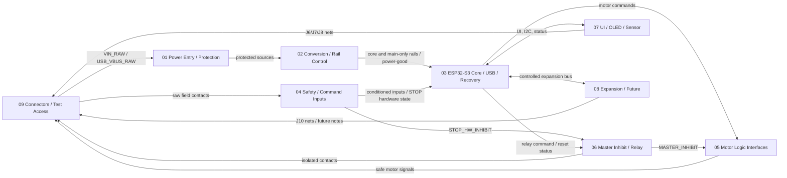

# IPC-100 Rev A Schematic Hierarchy and Block Interface Definition

> **ADR-044 amendment (2026-07-30):** Sheet 03 GPIO42 produces `WATCHDOG_SERVICE_MCU`; Sheet 00 routes it only to Sheet 06. Sheet 06 locally biases and independently qualifies the transition stream to generate `WATCHDOG_VALID`. GPIO37 is the sole future reserve. Sheet 05 and connectors are unchanged.

| Document control | Value |
| --- | --- |
| Platform | Iron Pine IPC-100 |
| Hardware revision | Rev A |
| Status | Controlled preliminary schematic implementation plan |
| Date | 2026-07-29 |
| Owner | Iron Pine Outdoors Engineering |

## 1. Purpose

This document converts the approved IPC-100 architecture into a controlled KiCad hierarchy. It assigns one owner to every sheet, functional block, rail, signal stage, connector symbol, and review gate so preliminary capture can proceed without disguising unresolved electrical decisions as circuit detail.

## 2. Scope

This plan defines hierarchy, block boundaries, cross-sheet interfaces, naming, ownership, protection location, ground/return concepts, test access, population options, capture order, and readiness. It intentionally stops before final components, values, footprints, complete circuits, board geometry, PCB placement/routing, and firmware implementation.

## 3. Governing documents

- [System Architecture](../architecture/System_Architecture.md)
- [Design Decisions](../architecture/Design_Decisions.md)
- [Functional Requirements](../requirements/Functional_Requirements.md)
- [Hardware Requirements](../requirements/Hardware_Requirements.md)
- [Power Architecture Engineering Review](../power/Power_Architecture_Engineering_Review.md)
- [Safety Input Architecture Review](../interfaces/Safety_Input_Architecture_Review.md)
- [Output Electrical Architecture Review](../interfaces/Output_Electrical_Architecture_Review.md)
- [GPIO and Peripheral Allocation Review](../connectors/GPIO_and_Peripheral_Allocation_Review.md)
- [Connector Specification](../connectors/Connector_Specification.md)
- [Open Design Items](../revisions/Open_Design_Items.md)
- [Schematic Readiness Review](../revisions/Schematic_Readiness_Review_Rev_A.md)

Stable external and firmware-facing signal names remain authoritative. Internal stage names introduced here do not rename an external interface.

## 4. Design maturity

Architecture, safe states, proposed GPIO allocation, and this implementation partition are sufficiently mature for empty KiCad hierarchy creation and controlled block-level capture. Quantitative electrical contracts and exact components are not mature. The exact ESP32-S3-WROOM-1 ordering variant, J11 disposition approval, and inhibit diagnostic-resource decision remain entry conditions for detailed MCU capture.

| Activity | Authorization |
| --- | --- |
| Create KiCad project, root sheet, and empty hierarchical sheets | Authorized after hierarchy review |
| Add controlled hierarchical labels and generic functional blocks | Authorized |
| Add connector placeholders following ownership rules | Authorized where pin counts are sufficiently defined |
| Capture complete electrical circuits | Not authorized |
| Select final components/values or assign footprints | Not authorized |
| Begin PCB layout | Not authorized |

## 5. Schematic hierarchy

The recommended ten-sheet hierarchy is retained because it separates energy entry, rail generation, processor/service, safety inputs, actuator commands, hardware inhibit/relay, nonessential UI, future expansion, and physical interfaces.

| ID | Sheet title | Purpose and included functions | Explicitly excluded | Connector symbols | Rails generated | Rails consumed | Incoming nets | Outgoing nets | Optional content | Main blocker | Readiness |
| --- | --- | --- | --- | --- | --- | --- | --- | --- | --- | --- | --- |
| 00 | Top-Level System | Hierarchical block interconnect, rail/signal visibility, architecture notes | Components, protection detail, connector symbols | None | None | None | None | All cross-sheet ports | None | Hierarchy approval | Satisfied |
| 01 | Power Entry and Protection | J1-side input protection block, USB VBUS protection, battery-sense front end, raw source status | Regulators, USB data, connector symbol | None | `VIN_PROTECTED`, `USB_5V_PROTECTED`, `BATTERY_SENSE` | `VIN_RAW`, `USB_VBUS_RAW` | Raw sources from 09 | Protected sources/status to 02/03/06 | Input indicator concept | Abnormal-input and USB contracts | Partially satisfied |
| 02 | Power Conversion and Rail Control | Main 5 V, core source selection, 3.3 V core, main-only branch control, power-good generation | Input transient protection, load-interface conditioning | None | `+5V_MAIN`, `CORE_SOURCE`, `+3V3_CORE`, `RELAY_VCC`, `MOTOR_LOGIC_5V_A/B`, `OLED_VCC`, `SENSOR_VCC`, `UI_VCC`, `EXPANSION_VCC`, `MAIN_POWER_GOOD` | `VIN_PROTECTED`, `USB_5V_PROTECTED` | Protected sources, enable requests | Rails and qualified status | Separately controlled peripheral branches | Load envelopes/topologies | Partially satisfied |
| 03 | ESP32-S3 Core, Boot, Reset, USB, and Recovery | Module placeholder, core support placeholders, EN/GPIO0, USB data, UART0, straps, GPIO fanout, ADC termination, I2C/MCPWM/status/control nets | Field protection, power conversion, motor/relay drivers | None | `RESET_VALID`, MCU command nets | `+3V3_CORE`, `BATTERY_SENSE` | Conditioned inputs, inhibit/rail status | MCU commands, I2C, USB/UART, diagnostics | Optional UART access population controlled on 09 | Exact module variant | Partially satisfied |
| 04 | Safety and Command Inputs | STOP/limit/ARM/FIRE field protection, supervision, conditioning, fault states; conservative defaults | Connector symbols, product mechanics, master-inhibit decision logic | None | Seven conditioned inputs, local fault test nets, `STOP_HW_INHIBIT` | Field-sense power, `+3V3_CORE` | Raw contact/return nets from 09 | MCU inputs and STOP hardware state | None | ADR-042 / External Safety ICD | Satisfied for preliminary capture |
| 05 | Motor-Driver Logic Interfaces | Two-axis conflict suppression, safe gating, conditioning/translation, interface-power fault boundaries | Motor current, motor drivers, master-inhibit generation, limits/position/feedback | None | Eight connector-side safe command nets | `+3V3_CORE`, `MOTOR_LOGIC_5V_A/B` | Eight MCU commands, `ACTUATOR_PERMIT`, `MASTER_INHIBIT` | Eight J2/J3 nets | Command test nodes only | ADR-043 / Motion Control ICD | Satisfied for preliminary capture |
| 06 | Relay Output and Master Inhibit | Entire inhibit decision/qualification block, reset/watchdog/power/STOP interaction, relay authorization, coil drive placeholder, isolation boundary | Contact-side load protection, motor conditioning, power generation | None | `MASTER_INHIBIT`, `ACTUATOR_PERMIT`, `WATCHDOG_VALID`, relay coil actuation | `+3V3_CORE`, `RELAY_VCC` | `STOP_HW_INHIBIT`, `MAIN_POWER_GOOD`, `RESET_VALID`, `WATCHDOG_SERVICE_MCU`, `RELAY_CMD_MCU` | Motor inhibit, relay contact nets to 09, test-only watchdog observation | No firmware feedback | ADR-044 watchdog contract and inhibit circuit ratings | Interface satisfied; circuit deferred |
| 07 | User Interface and Peripherals | RGB/buzzer drive placeholders, OLED/sensor interfaces, I2C boundary, OLED reset conditioning, encoder conditioning | Safety inputs, shared I2C expansion protection, connector symbols | None | Conditioned encoder nets, J6/J7/J8-side UI nets | `+3V3_CORE`, `UI_VCC`, `OLED_VCC`, `SENSOR_VCC` | MCU UI/status/I2C/reset nets | Physical-interface nets to 09 | OLED/sensor/RGB/buzzer populations | Modules, loads, I2C contract | Partially satisfied |
| 08 | Expansion and Future Interfaces | ICD-001 optional J10 segmented I2C buffer, rail-valid isolation, external pull-ups, local protection, stuck-bus containment, and DFT nodes | J11/J12 pinouts, unapproved transceivers, GPIO37, field buses | None | None | `+3V3_CORE`, optional `EXPANSION_VCC` | `I2C_SDA`, `I2C_SCL` | `J10_I2C_SDA`, `J10_I2C_SCL` | J10 circuitry DNP; future blocks documentary | Exact buffer/protection selection; no J11/J12 pins | Satisfied for preliminary capture by Package 09R |
| 09 | Connectors, Test Points, and Production Access | Sole ownership of J1–J13 symbols, net breakout, shields, all test/debug access, production fixture boundary | Functional conditioning and decision logic | J1–J13 | None | All connector-carried rails | Interface nets from functional sheets | Raw connector nets to functional sheets | UART/test-only access; DNP connector options | Connector families/pin counts/test fixture | Partially satisfied |

### 5.1 Top-level architecture



Sheet 00 shows these blocks, rail classes, and named interfaces only. It may include architecture notes and unresolved-item references but no electrical implementation.

## 6. Sheet ownership

Every functional block has one schematic owner. A source sheet owns generation or conditioning; a destination consumes the exported net without recreating the source circuit.

| Block | Owner | Consumers | Ownership rule |
| --- | --- | --- | --- |
| Raw power/USB protection | 01 | 02, 03 | All high-energy entry protection remains at entry |
| Rail generation/control | 02 | 03–09 | Only 02 creates controlled rails |
| Processor, reset, boot, service | 03 | 04–08 | Only 03 owns module and processor pins |
| Safety/command conditioning | 04 | 03, 06 | Only 04 interprets field electrical states |
| Motor output conditioning | 05 | 09 | Only 05 converts MCU commands to external-driver contract |
| Master-inhibit decision | 06 | 05 and relay path | Entire logic belongs on 06 |
| Relay coil and isolation boundary | 06 | 09 | Contact load remains product-owned |
| UI/peripheral conditioning | 07 | 03, 09 | Shared onboard peripheral bus terminates here |
| Expansion interface conditioning | 08 | 03, 09 | J10 external exposure is isolated from core bus as approved |
| Connector/test symbols | 09 | All | No physical connector or production-access symbol appears elsewhere |

### 6.1 MCU core boundary

Sheet 03 contains the exact-module placeholder, decoupling and support placeholders, EN/reset, GPIO0 boot management, native USB D-/D+, UART0 recovery, production-programming interface, strap management, GPIO fanout, ADC endpoint, I2C0, MCPWM outputs, status outputs, and approved processor-side diagnostic inputs. ADR-041 removes `MAIN_POWER_GOOD` from the processor boundary; no main-good GPIO or substitute status is permitted.

Sheet 03 explicitly excludes external input protection, supervised-loop conditioning, motor-driver conditioning, relay-coil actuation, high-energy transient protection, and power conversion. Its detailed capture is blocked by the exact ESP32-S3-WROOM-1 ordering variant and the unresolved diagnostic-resource set.

### 6.2 Safety and command input boundary

Each Sheet 04 interface follows this block-level chain:

```text
Sheet 09 external connector
  -> field protection
  -> supervision or conditioning
  -> filtering/debounce electrical boundary
  -> logic-domain translation where required
  -> conditioned MCU signal
  -> fault/diagnostic observation
  -> STOP hardware-inhibit path where applicable
```

The product/harness owns approved field contacts and field termination. Sheet 09 owns connector symbols and individual loop-return pins. Sheet 04 owns protection, state supervision, conservative defaults, fault detection, logic-domain output, STOP hardware path, and associated test-node sources. Sheet 03 owns only the processor input. Base firmware qualifies events and reports diagnostics but does not create the electrical safe state.

Encoder inputs belong on Sheet 07 because they are non-safety UI signals sharing the user-interface location and optional population behavior. Keeping them outside Sheet 04 prevents nonessential encoder circuitry from becoming part of the safety-input review boundary.

### 6.3 Motor interface boundary

Sheet 05 implements this generic chain for all eight signals:

```text
Sheet 03 MCPWM/GPIO command
  -> hardware MASTER_INHIBIT enforcement
  -> output conditioning or translation
  -> Sheet 09 connector
  -> external motor driver
```

Sheet 02 owns separate limited main-only interface-power branches. Sheet 06 owns inhibit generation. Sheet 05 owns inactive-state enforcement at the external interface, enable gating, conditioning, output-side backfeed containment, and any later-approved diagnostic observation. Firmware owns command mutual exclusion and reversal sequencing. Test access must distinguish at least one MCU-side command from its post-inhibit safe-side result. External drivers, motor power, braking behavior, motors, and all operating current remain product-owned and off-board.

### 6.4 UI and peripheral boundary

Sheet 07 owns encoder conditioning, RGB/buzzer output-drive boundaries, OLED reset conditioning, the onboard/shared I2C segment, separate `OLED_VCC` and `SENSOR_VCC` interfaces, and J6/J7/J8-side functional nets. It must establish RGB off, buzzer silent, OLED reset asserted/non-driving, and unpowered-bus-safe behavior before firmware control.

OLED and sensor supplies remain separately controlled domains even if later quantification selects a common upstream voltage. Optional device absence is nonfatal. Sheet 07 owns local bus recovery up to the expansion boundary; Sheet 08 owns protection or segmentation associated with external J10 exposure.

## 7. Power ownership

Ground nets are described in Section 15. “Enable owner” identifies the sheet that creates a request or qualification, not a selected switch implementation.

| Rail/signal | Source sheet | Consumers | Enable owner | Monitor owner | Shutdown/USB-only behavior | Test access owner | Backfeed boundary |
| --- | --- | --- | --- | --- | --- | --- | --- |
| `VIN_RAW` | 09/J1 | 01 | External product | 01 battery front end | Removed with J1/product control; absent in USB-only | 09 | 01 entry block |
| `VIN_PROTECTED` | 01 | 02 | Entry validity | 01/02 | Collapses on rejected/removed input; absent in USB-only | 09 | 01 |
| `+5V_MAIN` | 02 | 02, 05, 06, 07, 08 | Valid main source | 02 | Off in USB-only; controlled collapse cannot pulse outputs | 09 | Source and per-branch controls on 02 |
| `USB_5V_PROTECTED` | 01 | 02, source detect | USB host/entry validity | 01/02 | Available only with valid USB; cannot power main-only loads | 09 | 01 USB entry and 02 selector |
| `CORE_SOURCE` | 02 | 02 core regulator | Source selector | 02 | May use main or USB without cross-feed | 09 | 02 |
| `+3V3_CORE` | 02 | 03–08 essential logic | Valid core source | 02/03 reset | May remain in bounded USB-only service; brownout holds core invalid | 09 | 02 and every external interface |
| `RELAY_VCC` | 02 | 06 | Main-valid qualification plus inhibit on 06 | 02/06 | Off/de-energized in USB-only or invalid main | 09 optional | 02 branch and 06 actuation |
| `MOTOR_LOGIC_5V_A/B` | 02 | 05/09 J2/J3 | Main-valid; authorization on 06 | 02/optional 05 | Off in USB-only; commands safe before collapse | 09 | Separate branch boundaries on 02/05 |
| `OLED_VCC` | 02 | 07/09 J6 | MCU request only after safe init; main-valid qualification | 02/07 | Main-only, default off | 09 optional | 02 branch and 07 interface |
| `SENSOR_VCC` | 02 | 07/09 J7 | MCU request only after safe init; main-valid qualification | 02/07 | Main-only, default off | 09 optional | 02 branch and 07 interface |
| `UI_VCC` | 02 | 07/09 J8 | Main-valid/controlled UI request | 02/07 | Main-only, default off where active drive exists | 09 optional | 02/07 |
| `EXPANSION_VCC` | 02 | 08/09 J10 if approved | Explicit optional request after safe init | 02/08 | Main-only, default off | 09 optional | 02/08 |
| `FIELD_SENSE_VCC` | 02 | 04 | Main-valid hardware state | 02/04 | Off in USB-only; 04 produces conservative states | 09 optional | 02/04 |
| `MAIN_POWER_GOOD` | 02 | 02 branch gating, 06 | Hardware qualification | 02 | False/invalid in USB-only; not processor-visible | 09 required prototype | N/A |
| `BATTERY_SENSE` | 01 | 03 ADC | None | 03 firmware | Invalid when main absent; no phantom core power | 09 | 01 ADC front end |

`OLED_VCC` and `SENSOR_VCC` remain separate controlled domains. Sharing a final source rail is allowed only if each connector retains its separately reviewable enable/fault boundary and module compatibility.

## 8. Signal ownership

The following matrix covers all 27 required application signals plus service, management, and candidate diagnostic nets. Top-level exposure means a hierarchical port on Sheet 00.

| Logical signal | Source sheet | Destination | Owning block | Electrical-state owner | Firmware owner | Class | Top-level | Test expectation | Maturity |
| --- | --- | --- | --- | --- | --- | --- | --- | --- | --- |
| `STOP_IN` | 04 | 03 | STOP conditioning | 04 + external supervision | Base input service | Safety input | Yes | Conditioned state required | Behavior fixed; quantitative open |
| `LIMIT_LEFT` | 04 | 03 | Limit conditioning | 04 | Base/product mapping | Safety input | Yes | Representative plus connector | Behavior fixed; quantitative open |
| `LIMIT_RIGHT` | 04 | 03 | Limit conditioning | 04 | Base/product mapping | Safety input | Yes | Connector/diagnostic | Same |
| `LIMIT_UP` | 04 | 03 | Limit conditioning | 04 | Base/product mapping | Safety input | Yes | Connector/diagnostic | Same |
| `LIMIT_DOWN` | 04 | 03 | Limit conditioning | 04 | Base/product mapping | Safety input | Yes | Connector/diagnostic | Same |
| `ARM_IN` | 04 | 03 | Command conditioning | 04 | Base qualification | Command input | Yes | Optional debug | Behavior fixed; quantitative open |
| `FIRE_IN` | 04 | 03 | Command conditioning | 04 | Base qualification | Command input | Yes | Optional debug | Same |
| `ENCODER_A` | 07 | 03 | UI input conditioning | 07 | Base UI service | Non-safety UI | Yes | Optional debug | GPIO proposed; circuit open |
| `ENCODER_B` | 07 | 03 | UI input conditioning | 07 | Base UI service | Non-safety UI | Yes | Optional debug | Same |
| `ENCODER_SW` | 07 | 03 | UI input conditioning | 07 | Base UI service | Non-safety UI | Yes | Optional debug | Same |
| `AXIS1_RPWM` | 03 | 05 | MCPWM/conditioning | 05 safe stage | Base motor service | Safety output | Yes | MCU and safe-side prototype | GPIO proposed; electrical open |
| `AXIS1_LPWM` | 03 | 05 | MCPWM/conditioning | 05 safe stage | Base motor service | Safety output | Yes | Same | Same |
| `AXIS1_REN` | 03 | 05 | GPIO/conditioning | 05 safe stage | Base motor service | Safety output | Yes | MCU and safe-side prototype | Same |
| `AXIS1_LEN` | 03 | 05 | GPIO/conditioning | 05 safe stage | Base motor service | Safety output | Yes | Same | Same |
| `AXIS2_RPWM` | 03 | 05 | MCPWM/conditioning | 05 safe stage | Base motor service | Safety output | Yes | Representative | Same |
| `AXIS2_LPWM` | 03 | 05 | MCPWM/conditioning | 05 safe stage | Base motor service | Safety output | Yes | Representative | Same |
| `AXIS2_REN` | 03 | 05 | GPIO/conditioning | 05 safe stage | Base motor service | Safety output | Yes | Representative | Same |
| `AXIS2_LEN` | 03 | 05 | GPIO/conditioning | 05 safe stage | Base motor service | Safety output | Yes | Representative | Same |
| `RELAY_CTRL` | 03 | 06 | Relay command | 06 inhibit/actuation | Base output service | Safety output | Yes | Relay command/drive required | GPIO proposed; implementation open |
| `RGB_R` | 03 | 07 | Status drive | 07 | Base/product status | Status output | Yes | Optional debug | GPIO proposed; load open |
| `RGB_G` | 03 | 07 | Status drive | 07 | Base/product status | Status output | Yes | Optional debug | Same |
| `RGB_B` | 03 | 07 | Status drive | 07 | Base/product status | Status output | Yes | Optional debug | Module-dependent GPIO |
| `BUZZER_OUT` | 03 | 07 | Audible drive | 07 | Base/product status | Status output | Yes | Optional debug | Module-dependent GPIO/load |
| `OLED_RESET` | 03 | 07 | Display reset interface | 07 | Base display driver | Peripheral control | Yes | Prototype debug | GPIO proposed; implementation open |
| `I2C_SDA` | 03 | 07 and 08 | I2C0/core bus | 07 core bus; 08 external boundary | Base I2C service | Shared bus | Yes | Prototype debug; controlled probing | GPIO variant-dependent |
| `I2C_SCL` | 03 | 07 and 08 | I2C0/core bus | 07 core bus; 08 external boundary | Base I2C service | Shared bus | Yes | Same | Same |
| `BATTERY_SENSE` | 01 | 03 | ADC front end | 01 | Base monitor | Analog monitor | Yes | Required prototype | ADC proposed; analog open |
| `USB_D-`, `USB_D+` | 09/01 boundary | 03 | Native USB | 01 protects; 03 terminates | ROM/base service | Service | Yes | Connector-accessible; no routine probing | Fixed GPIO; circuit open |
| `UART0_TX`, `UART0_RX` | 03 | 09 fixture | Recovery UART | 03 | ROM/base service | Service | Yes | Required production access | Pins reserved |
| `ESP_EN` | 09 fixture/03 | 03 | Reset | 03 | ROM/hardware | Management | Yes | Required production | Circuit open |
| `ESP_BOOT` / GPIO0 | 09 fixture/03 | 03 | Boot mode | 03 | ROM | Management | Yes | Required production | Pin reserved |
| `MAIN_POWER_GOOD` | 02 | 02 branch gating, 06 | Power qualification | 02 | Hardware only; no firmware consumer | Safety status | Yes | Required prototype | Threshold open |
| `RESET_VALID` | 03 | 06 | Reset qualification | 03 | None/base diagnostic | Safety status | Yes | Required prototype | Implementation open |
| `STOP_HW_INHIBIT` | 04 | 06 | STOP hardware path | 04 | None | Safety status | Yes | Required prototype | Implementation open |
| `MASTER_INHIBIT` | 06 | 05 and relay actuation | Inhibit decision | 06 | Cannot override | Safety control | Yes | Required production/prototype | Behavior fixed; circuit open |
| `MASTER_INHIBIT_STATUS` | Not adopted | None | No Rev A GPIO | 06 if added later | None | Diagnostic reservation only | No | No | ADR required |
| `WATCHDOG_VALID` | 06 watchdog | 06 permit logic and test access | Watchdog qualification | 06 | No processor feedback | Safety status | No | Required prototype | Boundary fixed by ADR-042 |
| `INPUT_FAULT_SUMMARY` | Not adopted | None | No Rev A GPIO | 04 if added later | None | Diagnostic reservation only | No | No | ADR required |
| `POWER_FAULT_SUMMARY` | 01/02 | 03 | Power diagnostics | 01/02 | Base diagnostics | Diagnostic candidate | Yes if adopted | Optional | Hardware support open |

## 9. Cross-sheet interface rules

1. Every net crossing a sheet boundary appears on Sheet 00 and has exactly one source owner.
2. Power symbols do not silently cross functional boundaries; controlled rails use explicit hierarchical ports.
3. Raw field nets end at the owning protection/conditioning sheet. Only conditioned processor-domain nets reach Sheet 03.
4. MCU command nets end at the safe/drive sheet. Only `_SAFE` nets reach physical connectors.
5. Connector symbols and fixture/test symbols exist only on Sheet 09.
6. Global labels are limited to controlled power and ground nets. Functional signals use hierarchical labels.
7. Optional feedback nets are not connected to MCU pins until their resource requirement is approved.
8. Unused hierarchical ports are explicitly marked reserved or not fitted, never silently left ambiguous.
9. Sheet notes cite requirement IDs and open-item IDs for unresolved contracts.
10. No sheet may create an alternate path around `MASTER_INHIBIT`.

## 10. Net-naming rules

Stable external names stay unchanged at connector and firmware boundaries. Internal names reveal signal stage.

| Category/suffix | Meaning | Example | Boundary rule |
| --- | --- | --- | --- |
| `_RAW` | Unprotected connector-side or source-side net | `STOP_IN_RAW`, `USB_VBUS_RAW` | 09 to entry/conditioning sheet only |
| `_PROTECTED` | Passed entry protection but not necessarily regulated | `VIN_PROTECTED`, `USB_5V_PROTECTED` | Source owner to downstream power sheet |
| `_COND` | Conditioned processor-domain observation | `LIMIT_LEFT_COND` | 04/07 to 03 |
| `_FAULT` | Detectable invalid/fault state; polarity not implied | `STOP_FAULT` | Diagnostic path only |
| `_MCU` or `_CMD_MCU` | Processor-originated pre-safety command | `AXIS1_RPWM_MCU`, `RELAY_CMD_MCU` | 03 to drive/inhibit owner |
| `_SAFE` | Post-inhibit/post-safe-state command | `AXIS1_RPWM_SAFE`, `AXIS1_REN_SAFE` | 05/06 toward 09 |
| `_STATUS` | Observed state, not authorization | `MASTER_INHIBIT_STATUS` | Reserved naming only; ADR-042 does not adopt permit feedback in Rev A |
| `_GOOD` / `_VALID` | Affirmative qualified condition only when thresholds are defined | `MAIN_POWER_GOOD`, `RESET_VALID` | Never used for an unqualified raw level |
| `_RETURN` | Dedicated paired field return | `LIMIT_LEFT_RETURN` | 09 to 04; never generic ground alias |
| `_N` | Electrically active-low | Use only after polarity is approved | Prohibited while polarity remains TBD |

Recommended internal chains include:

- `STOP_IN_RAW` → conditioning/supervision → `STOP_IN_COND`, `STOP_FAULT`, `STOP_HW_INHIBIT`;
- `LIMIT_LEFT_RAW` → conditioning/supervision → `LIMIT_LEFT_COND`, `LIMIT_LEFT_FAULT`;
- `ARM_IN_RAW` → conditioning → `ARM_IN_COND`;
- `AXIS1_RPWM_MCU` → inhibit/conditioning → `AXIS1_RPWM_SAFE`;
- `RELAY_CMD_MCU` → inhibit authorization → `RELAY_AUTH_SAFE` → `RELAY_COIL_DRIVE`.

ADR-042 freezes `MASTER_INHIBIT` active high and `ACTUATOR_PERMIT` active high, with `MASTER_INHIBIT = NOT ACTUATOR_PERMIT`. `STOP_HW_INHIBIT` and all processor-conditioned STOP/limit/ARM/FIRE observations are active high when asserted. Reserved names include the stable connector signals, all GPIO-map logical names, and rail names already controlled by the power architecture.

## 11. Connector ownership

Sheet 09 owns every connector symbol. “Functional sheet” owns the connected circuitry and contract.

| ID | Function | Symbol owner | Functional sheet | Signals/power | Boundary | Safety/partition | Status/blocker |
| --- | --- | --- | --- | --- | --- | --- | --- |
| J1 | Controller input | 09 | 01 | `VIN_RAW`, `GND` | Field | High-energy entry | Pin count logical; family/rating/protection open |
| J2 | Axis 1 logic | 09 | 05 | Interface power, GND, four Axis 1 signals | Field/external driver | No motor current; noisy separation | Quantitative contract open |
| J3 | Axis 2 logic | 09 | 05 | Interface power, GND, four Axis 2 signals | Field/external driver | Same as J2 | Same |
| J4 | Limits 1 | 09 | 04 | Left/right contacts and individual returns | Field | Supervised safety loops | Four logical conductors; implementation open |
| J5 | Limits 2 | 09 | 04 | Up/down contacts and individual returns | Field | Supervised safety loops | Same |
| J6 | OLED | 09 | 07 | `OLED_VCC`, GND, I2C, reset | External peripheral | Main-only; bus/backfeed boundary | Module/domain open |
| J7 | Environmental sensor | 09 | 07 | `SENSOR_VCC`, GND, I2C | External peripheral | Main-only; bus/backfeed boundary | Module/domain open |
| J8 | Controls/indicators | 09 | 04 and 07 | STOP/ARM/FIRE, encoder, RGB, buzzer, limited power/returns | Field/UI | STOP partition required | Physical partition and loads open |
| J9 | Isolated relay contacts | 09 | 06 | NC/COM/NO | Isolated external load | Separation from logic; product load ownership | Ratings/family open |
| J10 | Controlled I2C expansion | 09 | 08 | Controlled power, GND, I2C | Optional external | Fault containment; not arbitrary field bus | Electrical contract open |
| J11 | Spare GPIO concept | 09 documentation only | 08 | No released Rev A pinout | Future | Non-safety only | Recommend no Rev A connector symbol/pads |
| J12 | Future communications | 09 documentation only | 08 | No released CAN/RS485 pinout | Future | Differential-interface-specific | Future revision only |
| J13 | USB-C service | 09 | 01 and 03 | VBUS, D-/D+, CC, shield, GND | Service | Core-only power/backfeed/shield boundary | USB implementation/family open |

## 12. Protection placement

| Exposure | IPC-100 location/owner | External owner | Rule |
| --- | --- | --- | --- |
| Battery input | Sheet 01 near J1 logical boundary | Product fuse/distribution | IPC-100 contains local entry faults; product contains source energy |
| USB | Sheet 01 VBUS/protection; 03 data termination; 09 shield/connector | Host cable/port | Prevent host backfeed and protect fixed USB pins |
| Digital contacts | Sheet 04 or 07 immediately after 09 raw nets | Product switch/harness environmental suitability | No direct field-to-MCU path |
| Supervised loops | Sheet 04 | Field termination/harness as released | Preserve individual returns and fault observability |
| Motor logic outputs | Sheet 05 before 09 | External driver protects motor-power side | Contain shorts/backfeed; motor current never enters IPC-100 |
| Relay contacts | Sheet 06/09 defines isolation/ratings | Product load supplies protection and inductive-load suppression | IPC-100 does not assume external load type |
| I2C expansion | Sheet 08 | Daughterboard/harness as approved | External fault must not defeat core safe startup |
| Battery ADC | Sheet 01 | None beyond product source protection | Bound injection and prevent phantom power |
| Connector-side ESD | Functional entry sheet adjacent to 09 boundary | Product enclosure may add system-level protection | One clearly owned boundary per exposed signal |
| Backfeed | Source/branch sheet: 01, 02, 05, 07, or 08 | Independently powered attachment must honor contract | Verify every power state and connection order |
| Shield/chassis | Sheet 09 concept and later mechanical review | Product enclosure/harness | No uncontrolled shield-to-logic connection |

No final protection device is selected here.

## 13. Master-inhibit partition

Sheet 06 owns the complete master-inhibit decision block. This avoids split ownership where power, STOP, reset, and watchdog logic could each create inconsistent actuator authorization.

Inputs to Sheet 06:

- `STOP_HW_INHIBIT` from Sheet 04;
- `MAIN_POWER_GOOD` from Sheet 02;
- `RESET_VALID` from Sheet 03;
- `WATCHDOG_SERVICE_MCU` transition service from Sheet 03/GPIO42;
- implicit/explicit USB-only qualification from power status;
- `RELAY_CMD_MCU` from Sheet 03.

Outputs from Sheet 06:

- `MASTER_INHIBIT` to Sheet 05 and the relay authorization chain;
- `RELAY_AUTH_SAFE` and `RELAY_COIL_DRIVE` internally;
- no permit, watchdog, individual electrical-fault, or fault-summary feedback to Sheet 03 in Rev A per ADR-042.

Power sheets own rail generation and `MAIN_POWER_GOOD`; they do not own the final actuator-authorization decision. Sheet 04 owns STOP electrical interpretation; it does not own motor or relay actuation. The selected inhibit circuit must force the safe state during invalid main power, reset, brownout, watchdog recovery, USB-only service, unknown STOP, and uninitialized operation without requiring firmware.

Relay chain:

```text
RELAY_CMD_MCU
  -> Sheet 06 master-inhibit authorization
  -> relay-coil drive block
  -> relay coil
  -> isolated NC/COM/NO contacts
  -> Sheet 09 / J9
```

Motor chain:

```text
MCPWM/GPIO command on Sheet 03
  -> MASTER_INHIBIT enforcement on Sheet 05
  -> output conditioning/translation
  -> Sheet 09 / J2 or J3
  -> external motor driver
```

Firmware owns mutual-exclusion validation and reversal sequencing. Hardware owns inactive defaults and inhibit override. Diagnostic feedback is optional until its safety value and GPIO resource are approved.

## 14. Test and diagnostic strategy

Sheet 09 owns every test-access symbol. A test node does not imply a pad style, header, or fixture design.

| Node | Classification | Access expectation | Notes |
| --- | --- | --- | --- |
| `VIN_RAW`, `VIN_PROTECTED` | Required prototype and production | Test-only access | Power-entry verification |
| `+5V_MAIN`, `CORE_SOURCE`, `+3V3_CORE` | Required prototype and production | Test-only access | Rail sequence/load |
| `USB_5V_PROTECTED` | Required prototype | Test-only access | USB source/backfeed |
| GND reference | Required production | Multiple controlled access points | Fixture reference; not a new domain |
| EN, GPIO0 | Required production | Fixture/possibly connector accessible | Manual recovery |
| UART0 TX/RX | Required production | Fixture/test-only; optional header population | Recovery without USB |
| USB D-/D+ | Connector-accessible | Direct probing not recommended except controlled integrity debug | Avoid routine loading/stubs |
| `BATTERY_SENSE` | Required prototype | Test-only access | ADC transfer/calibration |
| I2C SDA/SCL | Required prototype | Controlled debug access | Avoid harmful stubs/loading |
| `MAIN_POWER_GOOD`, `RESET_VALID` | Required prototype | Test-only access | Qualification timing |
| `MASTER_INHIBIT` | Required production and prototype | Test-only access | Prove safe-state override |
| `RELAY_CMD_MCU`, `RELAY_COIL_DRIVE` | Required prototype | Test-only access | Authorization versus actuation |
| Representative motor PWM/enable pre- and post-inhibit | Required prototype | Test-only access | At least Axis 1 pair; connector gives safe-side access |
| `STOP_IN_COND`, `STOP_HW_INHIBIT` | Required prototype/production | Test-only access | Conditioned and independent hardware path |
| One representative limit conditioned/fault state | Required prototype | Test-only access | Extend coverage through connector for all loops |
| Fault summaries/feedback | Optional debug unless adopted | Test-only access | Do not consume GPIO by default |

Production coverage must prove rails, reset/boot, native USB or UART recovery, master inhibit, STOP path, motor/relay safe defaults, and essential communications without energizing product actuators.

## 15. Optional-population boundaries

### 15.1 Expansion disposition

| Expansion concept | Classification | Rev A treatment |
| --- | --- | --- |
| J10 controlled I2C | Rev A optional population | Include a controlled Sheet 08 block and Sheet 09 symbol only after its electrical contract is approved |
| J11 spare GPIO | Rev B/future revision only | Documentation note; no released symbol, pads, or pinout in Rev A |
| GPIO37 | Conditional internal reserve | No connector claim; availability follows exact module variant |
| J12 CAN/RS485 | Rev A schematic placeholder/documentation only | No interchangeable connector or populated interface |
| Future TWAI | Shared peripheral capacity only | No guaranteed pins or circuitry |
| Future RS485 UART | Shared peripheral capacity only | No guaranteed TX/RX/direction pins or circuitry |
| Daughterboard | Future revision/interface study | No Rev A pinout or mechanical claim |

| Option | Circuits/connectors | Firmware expectation | Power impact | Validation | Schematic treatment |
| --- | --- | --- | --- | --- | --- |
| Base controller | Core, power, safety, motor interfaces, USB | Required platform baseline | Baseline | Full controller verification | Required |
| OLED interface/population | J6 and Sheet 07 blocks | Optional, absence nonfatal | `OLED_VCC` budget | Module/bus/power tests | Controlled DNP only if onboard module is contemplated |
| Environmental sensor | J7 and Sheet 07 blocks | Optional, absence nonfatal | `SENSOR_VCC` budget | Accuracy/environment/bus tests | Controlled DNP only if onboard population exists |
| Relay capability | Sheet 06/J9 | Hardware population declared by revision | `RELAY_VCC` budget | Isolation/load/safe-state tests | Avoid casual assembly omission if baseline requirement remains |
| J10 expansion | Sheet 08/J10 | Disabled unless compatible population declared | Expansion budget | Bus fault/backfeed tests | Optional connector population after contract |
| UART production header | Sheet 09 | No application dependency | Negligible | Recovery/fixture test | Pads/access required; connector DNP optional |
| Test-only debug options | Sheet 09 | Never required in production firmware | Controlled | Fixture-specific | DNP/test build only |
| CAN/RS485 | Sheet 08 notes | Must report unsupported | None in Rev A | Future package | Unpopulated/documentary; no false pinout |

Keep assembly variants minimal. Any omitted baseline safety or required interface creates a separate controlled hardware population, not an undocumented BOM choice.

## 15.1 AR-01 controlled interface amendment

ADR-039 amends the Sheet 01–03 contract as follows:

- Sheet 01 additionally outputs released-valid open-drain `MAIN_INPUT_VALID`.
- Sheet 02 additionally receives `MAIN_INPUT_VALID`, `OLED_POWER_REQ`, `SENSOR_POWER_REQ`, `UI_POWER_REQ`, and `EXPANSION_POWER_REQ`.
- Sheet 03 additionally outputs the four active-high request signals.
- Sheet 02 hardware-pulls every request low and qualifies it with `MAIN_POWER_GOOD`.
- Sheet 06 receives no new request signals and remains the sole owner of actuator authorization.

`OLED_VCC` and `SENSOR_VCC` are switched 3.3 V; `UI_VCC` is switched 5 V; `FIELD_SENSE_VCC` is hardware-enabled main-only 5 V; and `EXPANSION_VCC` is optional protected switched 3.3 V. The complete interface and state tables are in [Power Control Interface Resolution](Power_Control_Interface_Resolution.md).

## 16. Schematic-capture sequence

| Stage | Required inputs | Completion criteria | Blocker | Review output |
| --- | --- | --- | --- | --- |
| 1. Hierarchy/root | This document approved | Ten sheets and ports created; no components | Ownership dispute | Hierarchy review |
| 2. Power entry | Abnormal-input and USB objectives | Generic entry blocks and ports captured | Quantitative environment | Power-entry block review |
| 3. Power conversion | Load envelopes/rail states | Rail blocks, enables, monitors, branch ownership captured | Topology/load data | Power-tree review |
| 4. MCU/service | Exact module variant, GPIO proposal | Module placeholder, pins, EN/GPIO0, USB/UART, fanout captured | Exact variant/J11/inhibit feedback | MCU/recovery review |
| 5. Master inhibit | STOP/power/reset/watchdog contracts | Complete block chain and safe outputs represented | Implementation boundary/timing | Inhibit architecture review |
| 6. Safety inputs | Field voltage/state windows | Seven block chains, returns, faults, STOP path captured | Quantitative conditioning | Input review |
| 7. Motor outputs | Driver contract and PWM timing | Eight command chains and power/backfeed boundaries captured | Logic levels/load | Motor interface review |
| 8. Relay | Contact ratings/coil envelope | Coil and isolated contact block captured | Ratings/drive contract | Relay review |
| 9. UI/peripherals | Module/load/I2C decisions | UI, separate peripheral domains, bus/recovery captured | Modules/topologies | UI/I2C review |
| 10. Expansion | J10 contract and J11 decision | J10 block; J11/J12 explicit dispositions | Expansion decisions | Expansion review |
| 11. Connectors/test | Pin counts and access plan | One symbol per connector and controlled test list | Families/partition/fixture | Interface review |
| 12. Cross-sheet review | All block sheets | Direction, names, rails, safe states, no duplicate ownership | Open interface mismatch | Interface audit |
| 13. ERC preparation | Preliminary electrical capture | Pin types/power flags/no-connect intent controlled | Component-level details | ERC issue list |

## 17. Review gates

| Gate | Required artifacts | Pass criteria | Blocking defects | Authorized next activity |
| --- | --- | --- | --- | --- |
| 1 — Hierarchy approved | Sheet tree, ownership tables, ports | One owner per block/net/connector | Duplicate or missing owner | Create empty KiCad sheets |
| 2 — Power tree captured | Sheets 01/02 block capture | All sources/rails/states/backfeed boundaries shown | Hidden source or USB-to-main path | MCU block capture |
| 3 — MCU and recovery captured | Sheet 03, exact module evidence | Pin map matches controlled proposal; USB/UART/boot recoverable | Variant/pin/strap conflict | Interface block capture |
| 4 — Safety inputs captured | Sheet 04 chains | Individual returns, conservative states, diagnostics, STOP path visible | Direct field GPIO or missing fault state | Inhibit and output work |
| 5 — Master inhibit captured | Sheet 06 logic/sequence evidence | All required invalid states force inhibit; one owner | Firmware-only or bypass path | Output capture |
| 6 — Outputs captured | Sheets 05–07 | Safe/default states and power/backfeed boundaries shown | Unsafe startup or undefined domain | Connector/test capture |
| 7 — Connectors/test captured | Sheet 09 matrix and access plan | One connector symbol each; fixture supports critical tests | Duplicate symbol or untestable safety path | Cross-sheet review |
| 8 — Cross-sheet interface review | Netlist/port report | Names/directions/stages/power domains consistent | Dangling, aliased, or polarity ambiguity | ERC preparation |
| 9 — ERC-clean preliminary schematic | ERC report/deviations | No unexplained errors; warnings dispositioned | Hidden conflict or undocumented exception | Component-selection review |
| 10 — Component-selection review complete | Calculations, datasheets, derating, BOM candidates | Quantitative contracts met and traceable | Unverified rating/value/topology | Detailed schematic completion |

Passing a gate authorizes only the next listed activity, not PCB layout or release.

## 18. Remaining blockers

| Required stage | Decisions |
| --- | --- |
| Before any detailed schematic capture | Approve this hierarchy; select exact ESP32-S3-WROOM-1 variant; confirm GPIO35/36 availability and GPIO47/48 voltage compatibility; approve J11 Rev A disposition; decide mandatory inhibit feedback |
| Before affected sheet capture | Define watchdog boundary; supervised-input field voltage/windows; motor logic levels/timing; relay contact/coil envelope; OLED/sensor modules/domains; J8 partition; J10 contract |
| Before preliminary schematic completion | Complete power/load envelopes; USB source/data/CC/shield implementation; reset/boot/UART workflow; test-fixture access; connector pin counts; fault-diagnostic allocation |
| Before component selection | Approve abnormal-input/transient profiles; thermal/derating targets; quantitative protection, ADC, bus, interface, and timing contracts |
| Before schematic release | Select/verify all critical components and values; close traceability; complete fault analysis; ERC clean; approve controlled deviations; confirm antenna/enclosure relationship |
| Before PCB layout | Released schematic; footprints; connector families; board envelope/mounting; antenna keepout; creepage/clearance rules; stackup/current/thermal assumptions; DFM plan |

Unresolved circuits remain named generic blocks with linked open-item IDs. They are not filled with plausible but unapproved details.

## 19. Ground and return architecture

| Return | Electrical relationship | Schematic owner/rule |
| --- | --- | --- |
| `GND_LOGIC` | Common IPC-100 logic return for core, regulated rails, conditioned interfaces | Sheet 02 establishes; explicit global net |
| J1 `GND` / battery return | Electrically common with controller logic return at the approved board power-entry architecture | Sheet 01/02; not an isolated domain |
| USB GND | Common with controller logic ground as required by native USB | Sheet 09/03; shield treatment separate |
| J2/J3 logic GND | Common logic reference only; no motor-current return | Sheet 05/09 |
| UI/I2C connector grounds | Common logic/interface return subject to branch fault control | Sheets 07/08/09 |
| Supervised-loop returns | Dedicated individually routed sense returns, not generic connector grounds | Sheet 04/09; may reference common circuitry only inside conditioning block |
| `BATTERY_SENSE` return | Sensitive measurement reference to controlled logic/ADC return | Sheet 01/03; avoid noisy load-return sharing in later layout |
| Relay NC/COM/NO | Galvanically isolated contact domain | Sheet 06/09; never renamed or tied to logic ground |
| Shield/chassis | Product/enclosure concept, not automatically logic ground | Sheet 09 and mechanical review |

“Clean” and “dirty” describe current/noise management, not fictitious isolation. Motor operating current, motor return, and external relay load current do not flow through IPC-100 logic ground. PCB routing geometry and connection placement remain layout-stage decisions.

## 20. Schematic-entry assessment

| Area | Assessment | Basis |
| --- | --- | --- |
| Hierarchy | Satisfied | Ten coherent sheets defined |
| Sheet ownership | Satisfied | One owner per functional block |
| Power ownership | Satisfied at block level | Sources/consumers/enables/status defined |
| Signal ownership | Satisfied | Required signals and candidates mapped |
| Connector ownership | Satisfied | Sheet 09 sole symbol owner |
| MCU sheet readiness | Partially Satisfied | Exact module and diagnostic resources open |
| Safety-input sheet readiness | Partially Satisfied | Chains defined; quantitative field contract open |
| Motor-output sheet readiness | Partially Satisfied | Ownership defined; electrical contract open |
| Relay/inhibit readiness | Partially Satisfied | Single owner selected; implementation/ratings open |
| UI/peripheral readiness | Partially Satisfied | Separate domains selected; devices/load contracts open |
| Expansion readiness | Partially Satisfied | J11/J12 disposition recommendation awaiting approval |
| Test-access planning | Satisfied at block level | Critical nodes classified |
| Net naming | Satisfied | Stage/suffix rules defined |
| Ground architecture | Satisfied at schematic level | Common and isolated boundaries explicit |
| Exact module variant | Not Satisfied | Ordering variant not selected |
| Quantitative electrical contracts | Not Satisfied | Multiple sheet-level blockers remain |
| Component selection | Not Satisfied | Deliberately deferred |
| Preliminary capture authorization | Satisfied for hierarchy/generic blocks | Subject to gates |
| Released schematic authorization | Not Satisfied | Full design/evidence absent |
| PCB layout authorization | Not Satisfied | Schematic/mechanical/component gates open |

**Preliminary KiCad sheet creation:** Authorized after approval of Gate 1.

**Generic block and hierarchical-net placement:** Authorized under this plan.

**Full electrical capture and final component placement:** Not authorized until affected-sheet quantitative contracts are closed.

**Released schematic:** Not authorized.

**PCB layout:** Not authorized.

## 20.1 AR-02 Sheet 03 allocation and ownership amendment

ADR-040 establishes the following controlled rules for subsequent capture:

- Sheet 03 is the only schematic sheet that may reference raw ESP32 GPIO numbers.
- All other sheets use functional interface names exclusively.
- Sheet 03 directly produces `OLED_POWER_REQ`, `SENSOR_POWER_REQ`, `UI_POWER_REQ`, and `EXPANSION_POWER_REQ`; Sheet 02 electrically owns their pull-downs, qualification, and branch switching.
- Five low-risk UI functions (`RGB_R`, `RGB_G`, `RGB_B`, `BUZZER_OUT`, and `OLED_RESET`) move behind the Sheet 07 I²C functional boundary and are no longer direct Sheet 03 GPIO exports.
- Sheet 03 does not consume `MAIN_POWER_GOOD`; it creates local `CORE_POWER_GOOD` and exports `RESET_VALID`.
- `MAIN_INPUT_VALID` remains Sheet 01-to-02 only. `POWER_FAULT_SUMMARY` remains an input-path diagnostic and is not routed to Sheet 03.
- Sheet 03 owns the native USB processor pins and processor-side interface. Sheet 09 exclusively owns the USB-C connector, CC circuitry, connector-entry ESD/shield implementation, external pinout, and fixture contacts.
- GPIO37 is the sole non-exported future reserve. GPIO42 is allocated to `WATCHDOG_SERVICE_MCU`; neither creates a Rev A CAN, RS-485, or expansion port.

The Sheet 00 and child-sheet hierarchy must be synchronized with removal of the five obsolete direct UI exports when the affected capture package updates those sheet interfaces. No connector symbol moves out of Sheet 09.

## 20.2 AR-03 processor-visibility amendment

ADR-041 removes `MAIN_POWER_GOOD` from the Sheet 03 interface. Sheet 02 remains its sole producer and electrical owner, uses it internally for branch qualification, and exports it to Sheet 06 for fail-low actuator authorization. Firmware requests peripheral power but does not supervise whether main power is qualified.

Package 04R shall remove the `MAIN_POWER_GOOD` port from the Sheet 03 child symbol and child sheet while preserving the Sheet 02-to-Sheet 06 connection. No GPIO, reserve, Sheet 02 circuit, or Sheet 06 logic changes result from this amendment.

## 21. Recommended next engineering package

Proceed with **IPC-100 Rev A Critical Component Selection and Electrical Quantification**.

That package should calculate and select the critical implementations for power entry/protection, power conversion, USB source selection/protection, supervised inputs, master inhibit, motor conditioning, relay actuation, battery monitoring, controlled peripheral power, status outputs, connectors, and test access. Its released quantitative contracts will allow the preliminary schematic to progress from generic blocks to complete electrical capture.
