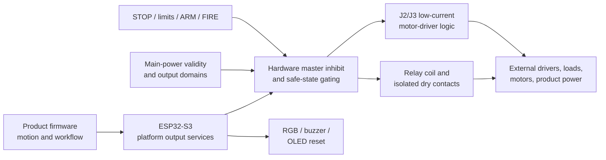
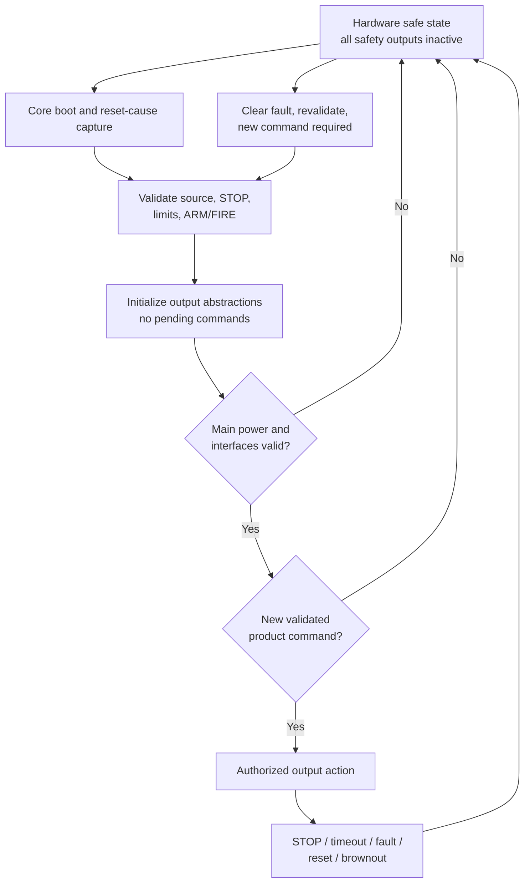

# IPC-100 Rev A Output Electrical Architecture Review

> **ADR-042 amendment (2026-07-30):** The [External Safety Interface Control Document](External_Safety_Interface_Control_Document.md) controls the Rev A `ACTUATOR_PERMIT`, `MASTER_INHIBIT`, STOP, reset, watchdog, motor-gating, and relay-gating boundary for Sheets 04–06. Earlier optional or polarity-open statements on those signals are historical.

| Document control | Value |
| --- | --- |
| Platform | Iron Pine IPC-100 |
| Hardware revision | Rev A |
| Review scope | Controller output electrical architecture |
| Date | 2026-07-29 |
| Status | Interface philosophy complete; quantitative/component design not authorized |
| Owner | Iron Pine Outdoors Engineering |

## 1. Purpose

This review defines the electrical and behavioral contract for every Rev A output before controlled schematic capture. It fixes ownership, classification, safe states, power-state behavior, sequencing, fault handling, diagnostics, and hardware/firmware boundaries without selecting components, values, connectors, circuits, or GPIOs.

## 2. Scope and output inventory

Covered outputs are:

- Axis 1: `AXIS1_RPWM`, `AXIS1_LPWM`, `AXIS1_REN`, `AXIS1_LEN`;
- Axis 2: `AXIS2_RPWM`, `AXIS2_LPWM`, `AXIS2_REN`, `AXIS2_LEN`;
- isolated relay contacts `RELAY_NO`, `RELAY_NC`, and `RELAY_COM`, plus internal logical `RELAY_CTRL`;
- `RGB_R`, `RGB_G`, and `RGB_B`;
- `BUZZER_OUT`;
- `OLED_RESET`;
- future reserved output concepts.

Power-output domains are governed by the Power Architecture Engineering Review. USB VBUS is not an IPC-100 output. Motor power and relay-contact load power are never IPC-100 outputs.

## 3. Output philosophy

IPC-100 outputs are controlled interfaces, not direct assumptions about processor pins or external loads. Required principles are:

- hardware establishes inactive outputs before firmware runs and preserves them through reset, brownout, watchdog recovery, unpowered states, and uncontrolled rail decay;
- a hardware master inhibit overrides motor-interface signals and relay-coil authorization independently of nonessential firmware;
- output activation requires valid main power, healthy STOP state, completed platform initialization, and a current validated command;
- directional limits inhibit only product-mapped motion toward the affected endpoint and never create motion away;
- no stale, repeated, malformed, conflicting, or recovered command automatically reactivates an output;
- external power and fault energy remain contained at released interface boundaries;
- status outputs cannot be used as the sole indication of a safety state;
- product firmware customizes meaning and workflow but cannot bypass platform safe states.

IPC-100 is not a certified motor safety controller or emergency-stop output system. Products own any independent contactor, brake, drive safety input, redundant disable, guarded reset, or regulatory function required by their hazard analysis.

## 4. Classification and safe-state summary

| Output | Primary classification | Secondary classification | Justification | Hardware-safe state |
| --- | --- | --- | --- | --- |
| Eight axis signals | Operational | Safety | Can cause external motion when interpreted by a powered driver | All PWM inactive; all enables disabled |
| `RELAY_CTRL` and coil state | Operational | Safety | Can change an externally powered circuit through isolated contacts | Coil de-energized; `RELAY_NO` open |
| `RELAY_NO` / `RELAY_NC` / `RELAY_COM` | Operational | Isolated passive output | Product-neutral dry contacts expose externally owned power | Passive de-energized contact state |
| RGB channels | Status | Diagnostic | Convey reusable visual state only | Inactive/off |
| `BUZZER_OUT` | Status | Diagnostic | Conveys reusable audible state only | Inactive/silent |
| `OLED_RESET` | Operational | Optional peripheral control | Holds optional display in defined reset and supports recovery | Reset asserted or non-driving without backfeed |
| Future reserved outputs | Future | Optional | No released Rev A function | Unpopulated, disabled, or non-driving |

“Safety” identifies control priority and hazard relevance, not a safety integrity rating.

## 5. Ownership

### 5.1 Power and electrical ownership

| Element | Owner | Responsibility |
| --- | --- | --- |
| Axis logic generation, conditioning, master inhibit, protection, and J2/J3 limited logic supply | IPC-100 | Meet released logic contract and prevent unsafe startup/backfeed |
| External motor driver logic receiver and power stage | External motor driver / product | Accept compatible logic, contain power-stage faults, define brake/coast behavior, and switch motor energy |
| Motor source, fuse, wiring, motor, suppression, and mechanical load | External product | Keep all motor current outside IPC-100 and complete hazard controls |
| Relay coil supply/control and isolation boundary | IPC-100 | Main-only, hardware-default-off actuation |
| Relay contact source, fuse, load, and wiring | External product or accessory | Stay within released contact/isolation ratings |
| RGB, buzzer, and OLED-reset interface conditioning | IPC-100 | Establish safe defaults and contain connector faults |
| External indicator/buzzer/display devices and harnesses | External product | Meet released load, voltage, cable, and environmental contracts |
| Future output loads | Future product/revision | No entitlement until an interface is released |

### 5.2 Firmware and hardware ownership

| Layer | Owns |
| --- | --- |
| Hardware | passive safe states; power-domain isolation; main-valid and STOP master inhibit; output drive capability; backfeed/fault containment; relay isolation; inactive behavior during reset/power loss |
| IPC-100 base firmware | ordered initialization; logical output abstraction; command validation; PWM generation; conflict/reversal interlocks; STOP/limit priority; timeouts; reset recovery; diagnostic state |
| Product firmware | motion profiles, direction mapping, arm/fire workflows, application timing, relay meaning, RGB colors/patterns, buzzer patterns, display reset use |
| Product hardware | external driver/load compatibility, high-current safety, mechanical stopping, external suppression, product-independent disconnects |

Firmware may never override hardware master inhibit, energize outputs in USB-only mode, treat an unknown STOP as healthy, bypass a direction limit to move farther into it, or restart an output automatically after reset/fault recovery.

## 6. Motor-interface architecture

### 6.1 Logical contract

Each axis retains four independent logical outputs. `RPWM` and `LPWM` are mutually exclusive direction-command channels. `REN` and `LEN` are independent enable provisions retained for compatibility and fault containment. The final electrical active level is deliberately separate from the logical active/inactive contract.

| Axis state | `RPWM` | `LPWM` | `REN` | `LEN` | Required interpretation |
| --- | --- | --- | --- | --- | --- |
| Hardware safe / disabled | Inactive | Inactive | Disabled | Disabled | No commanded motor torque or motion |
| Direction R command | Approved PWM/static command | Inactive | Approved enabled combination | Approved enabled combination | Motion only under validated product mapping |
| Direction L command | Inactive | Approved PWM/static command | Approved enabled combination | Approved enabled combination | Motion only under validated product mapping |
| Illegal conflict | Active/commanded | Active/commanded | Any | Any | Hardware/firmware shall force disabled state and report fault |
| Reversal transition | Inactive | Inactive | Disabled | Disabled | Driver passes through safe coast/disabled interval before opposite command |

The “approved enabled combination” remains tied to the released external-driver electrical contract; IPC-100 does not claim universal compatibility. Safe state always disables both enables and both PWM commands.

### 6.2 Enable and master-inhibit philosophy

- A common hardware master inhibit removes authorization from all axis enables/commands and the relay coil.
- Master inhibit is asserted during reset, boot, invalid main power, brownout, watchdog recovery, USB-only service, unknown/faulted STOP, and uninitialized operation.
- A firmware command alone cannot defeat master inhibit.
- Required logical signals remain independent, but the final circuit may gate them collectively or individually if the released behavior and diagnostics are preserved.
- Product-mapped direction limits are enforced by high-priority platform/product firmware because stable LEFT/RIGHT/UP/DOWN names do not prescribe a universal fixed axis-to-output wiring map. A product may add a separate hardware limit-to-drive path.
- Loss of processor control, output-stage power, or `MOTOR_LOGIC_5V` results in the disabled contract.

### 6.3 PWM and direction philosophy

- PWM frequency, resolution, minimum/maximum duty, static-high allowance, logic thresholds, and edge-rate limits remain quantitative design items.
- Only one direction PWM per axis may be active.
- Direction reversal disables both enables and makes both PWM channels inactive before an approved interlock interval and the new direction command.
- The Rev A safe stop is disable/coast. Active braking, dynamic braking, hold torque, or regeneration is not a baseline IPC-100 promise and requires a specific external-driver/product contract.
- A command timeout, communications loss, stale command, illegal combination, STOP, watchdog, or reset produces the safe disabled state.
- Recovery requires stable power, valid STOP/limits, cleared faults, completed initialization, and a new product command. The previous duty/direction is not replayed.

### 6.4 External-driver and future compatibility

J2/J3 provide limited main-only logic power and low-current signals, never motor power. External drivers may be unpowered, independently powered, disconnected, or faulted without backfeeding IPC-100. Interface voltage, source/sink capability, input current, logic thresholds, cable length, grounding, protection, and diagnostic feedback remain open.

The BTS7960-style reference explains the current four-signal pattern but is not a permanent dependency. Future drivers are supported through reviewed interface adapters or revisions, not by claiming universal compatibility from signal names alone.

## 7. Relay-output architecture

IPC-100 provides one isolated changeover dry-contact interface. `RELAY_CTRL` is an internal logical control; `RELAY_NO`, `RELAY_NC`, and `RELAY_COM` are passive external contacts.

- The coil is supplied only from the main-powered relay domain.
- Hardware master inhibit and passive bias keep the coil de-energized during power-up, reset, boot, STOP, brownout, watchdog recovery, USB-only service, processor failure, main-power loss, and uninitialized operation.
- The only platform safe-state claim is: coil de-energized and `RELAY_NO` open. `RELAY_NC` is mechanically connected to `RELAY_COM` in the passive contact state but has no platform-assigned product safety meaning.
- Relay activation requires valid main power, healthy STOP, completed platform initialization, and a current validated command. Product firmware owns what that activation means.
- STOP cancels relay authorization in hardware. Directional limits do not inherently control the product-neutral relay unless product logic requires it.
- The external product supplies, fuses, and validates the contact source/load. IPC-100 never supplies contact load power.
- Galvanic isolation between coil/control power and contacts is required. Contact voltage/current/load type, life, isolation, creepage/clearance, minimum load, switching frequency, and environmental derating remain quantitative selection inputs.
- Coil/output-stage faults shall be contained from `+3V3_CORE`; the coil transient shall be contained without selecting a method in this review.
- Contact welding, erosion, or failure to transfer cannot be assumed detectable without approved feedback. Product hazard analysis owns independent mitigation where failure to open is hazardous.
- Coil command/status diagnostics report only what the controller commanded and any approved driver feedback. They do not prove physical contact position unless feedback is added and validated.

## 8. Status and peripheral-control outputs

### 8.1 RGB

`RGB_R`, `RGB_G`, and `RGB_B` are three independent logical status channels.

- Default/reset/brownout/power-loss state is inactive/off.
- Channels are main-only external UI outputs and remain off during bounded USB-only service.
- PWM brightness is preferred but not required until the LED/load contract is selected.
- Package topology, active polarity, drive voltage/current, optical meaning, and cable limit remain open.
- A channel short/open/disconnect shall not defeat `+3V3_CORE`, STOP/limits, motor disable, or relay disable.
- Firmware owns product-neutral channel control and fault status where detectable; product firmware owns color, animation, and semantic meaning.
- RGB is supplemental status only and may never be the sole indication that an output is safe or power is removed.

### 8.2 Buzzer

`BUZZER_OUT` is a reusable audible-status output.

- Default/reset/brownout/power-loss state is inactive/silent.
- It is main-only and remains silent during USB-only service.
- The logical interface may support static or waveform drive; active/passive device selection, voltage/current, frequency range, sound pressure, duty cycle, and driver protection remain open.
- Continuous activation requires bounded firmware behavior; a stuck command or reset shall return to silent.
- Failure is nonfatal to safety initialization and shall not inhibit STOP or safe outputs.
- Product firmware owns audible patterns and meanings; IPC-100 owns safe initialization and any approved command bounds.

### 8.3 OLED reset

`OLED_RESET` is an optional peripheral-control output, not a status or safety output.

- Default is logical reset asserted while the OLED supply is off, starting, unknown, or faulted.
- It may release only after `OLED_VCC` is valid and the display interface has completed its required settling sequence.
- During USB-only service the OLED remains unpowered and reset remains asserted or electrically non-driving without backfeed.
- On normal shutdown, brownout, watchdog reset, processor reset, I2C recovery, or OLED power removal, reset asserts before or no later than loss of valid interface conditions where the hardware permits.
- The reference implementation uses active-low reset; the platform abstraction retains logical asserted/released semantics until the final module is approved.
- A short/open/disconnected reset line affects only the optional display and shall not block safe output initialization.

## 9. Per-output electrical contracts

### 9.1 Axis signals

| Output | Purpose / active behavior | Direction | Voltage and power domain | Default / fault state | Timing expectation | Isolation / protection | Ownership / diagnostics |
| --- | --- | --- | --- | --- | --- | --- | --- |
| `AXIS1_RPWM` | Axis 1 R direction PWM/static command | Out | Main-only conditioned logic; exact voltage TBD | Inactive under master inhibit | Frequency/duty/edge/reversal interval TBD | No baseline galvanic isolation; cable-entry, short, transient, and backfeed protection required | Base firmware command; product maps motion; commanded state diagnostic |
| `AXIS1_LPWM` | Axis 1 L direction PWM/static command | Out | Same | Inactive | Same | Same | Same |
| `AXIS1_REN` | Axis 1 R-side enable provision | Out | Same | Disabled | Must disable before/with command invalidation | Same; highest safe-state priority | Platform authorization and commanded state |
| `AXIS1_LEN` | Axis 1 L-side enable provision | Out | Same | Disabled | Same | Same | Same |
| `AXIS2_RPWM` | Axis 2 R direction PWM/static command | Out | Same | Inactive | Same | Same | Same |
| `AXIS2_LPWM` | Axis 2 L direction PWM/static command | Out | Same | Inactive | Same | Same | Same |
| `AXIS2_REN` | Axis 2 R-side enable provision | Out | Same | Disabled | Same | Same | Same |
| `AXIS2_LEN` | Axis 2 L-side enable provision | Out | Same | Disabled | Same | Same | Same |

External driver status/readback is not currently a locked signal. Absence of feedback shall not be misrepresented as proof that a driver or motor followed the command.

### 9.2 Relay contacts and control

| Output | Purpose / direction | Domain | Default / active state | Timing / isolation / protection | Ownership / diagnostics |
| --- | --- | --- | --- | --- | --- |
| `RELAY_CTRL` | Internal coil-control output | Main-only `RELAY_VCC` through isolated-control boundary | Default de-energized; active energizes coil after authorization | Activation/release/bounce/life TBD; hardware master inhibit; coil-fault containment required | IPC-100 hardware/base firmware; command status only unless feedback added |
| `RELAY_NO` | Passive normally-open contact | Externally powered isolated domain | Open with coil de-energized; closes when relay transfers | Contact ratings/isolation/protection external-load dependent | Product owns circuit and meaning |
| `RELAY_NC` | Passive normally-closed contact | Externally powered isolated domain | Connected to COM with coil de-energized; opens when relay transfers | Same; no platform safety meaning | Product owns circuit and meaning |
| `RELAY_COM` | Passive common contact | Externally powered isolated domain | Transfers between NC and NO | Same | Product owns circuit and meaning |

### 9.3 Status, reset, and future outputs

| Output | Purpose | Domain | Default / active | Fault and diagnostics |
| --- | --- | --- | --- | --- |
| `RGB_R`, `RGB_G`, `RGB_B` | Independent visual-status channels | Main-only UI domain; exact voltage TBD | Off; active/polarity/PWM TBD | Branch fault contained; commanded state and optional fault status |
| `BUZZER_OUT` | Audible-status control | Main-only UI domain; exact voltage TBD | Silent; static/waveform capability TBD | Branch fault contained; command bounded; optional fault status |
| `OLED_RESET` | Display reset/recovery | Processor-side logic referenced to switched `OLED_VCC` interface | Reset asserted or non-driving until display power valid | Display-only failure; no backfeed; commanded reset diagnostic |
| Future output concepts | Unreleased expansion or communications outputs | No guaranteed Rev A domain | Disabled/non-driving/unpopulated | No firmware claim until hardware contract released |

## 10. Common output-fault philosophy

| Condition | Hardware responsibility | Firmware / diagnostic responsibility | Required result |
| --- | --- | --- | --- |
| Short to return or supply | Bound fault current, protect rails/processor, isolate external branch | Disable affected output, report if detectable | Core and safe-state paths remain functional |
| Open circuit / disconnected load | Tolerate open output and connector unplug | Report only if approved feedback exists | No false claim of load action |
| Backfeed / external powered accessory | Block injection through supply, signal, protection, and unpowered output structures | Mark interface unavailable/faulted if observable | No phantom power or unsafe activation |
| Processor reset / crash | Passive bias and master inhibit force safety outputs inactive | Reinitialize; clear commands and authorization | No output pulse/restart |
| Brownout / main-power loss | Master inhibit and domain collapse produce safe state before logic is unreliable | Record cause if possible; clean restart | Motor disabled, relay off, status off/silent |
| Watchdog reset | Same hardware result as processor reset | Preserve/report cause; require new commands | No replay |
| USB-only operation | Main-only output domains remain off | Service mode rejects output commands | All external outputs safe/off |
| Unexpected disconnect | No damaging overshoot/backfeed within contract | Mark unavailable only if detectable | Other outputs/core remain safe |
| Unexpected power sequence | Safe state independent of which side powers first | Reject commands until validated | No injection or unintended action |
| Stuck output-stage active | Hardware master inhibit must remove upstream authorization; single component fault analysis required later | Detect only with approved feedback/plausibility | Product independent mitigation may be required |
| Relay welded contact | Isolation maintained within ratings; cannot force mechanical opening | Report only with added contact feedback | Product hazard mitigation required |
| Opposing motor commands | Gate/logic shall not intentionally present approved opposing active commands | Reject, disable, latch/report conflict | Axis disabled |

Protection parts, ratings, feedback, diagnostic coverage, and single-fault claims belong to schematic and prototype reviews.

## 11. Output sequencing

### 11.1 Startup

1. Passive hardware and unpowered domains establish motor PWM inactive, motor enables disabled, relay coil de-energized, RGB off, buzzer silent, and OLED reset asserted/non-driving.
2. Valid `+3V3_CORE` releases processor reset while hardware master inhibit remains asserted.
3. Reset/source state is recorded; bounded USB-only service never proceeds to output availability.
4. Under valid main power, STOP supervision validates first, followed by limit and command-input validation.
5. Base firmware initializes output abstractions with no pending commands.
6. Required external output supplies/conditioning become valid while commands remain inhibited.
7. OLED/status peripherals may initialize after safety inputs and hardware-safe outputs.
8. Relay and motor interfaces become *available* only after main power, safe inputs, output-stage health where detectable, and product compatibility are valid.
9. Product firmware may issue new validated commands. Availability is not activation.

### 11.2 Normal stop, emergency stop, and shutdown

- Normal motor stop removes PWM commands, then disables enables according to the approved driver timing; safe result is disabled/coast.
- Direction reversal follows the same disabled transition before the opposite command.
- Normal relay release removes coil authorization and returns contacts to their passive state.
- STOP immediately asserts master inhibit for motors and relay, ahead of UI, network, display, or product workflow.
- Normal shutdown disables relay/motor authorization first, makes status outputs inactive, asserts OLED reset, removes switched loads, then permits core decay.
- Brownout, crash, or unexpected power loss relies on hardware safe states rather than sequencing firmware.

### 11.3 Recovery

Recovery requires stable main power, healthy STOP, valid limit states, cleared output faults, initialized interfaces, released/renewed ARM/FIRE as applicable, and a new product command. Reset, watchdog, USB-to-main transition, fault clearing, or limit release shall not resume the previous output automatically.

## 12. Hardware versus firmware guarantees

### 12.1 Hardware shall always enforce

- reset/power-loss defaults for every output;
- master inhibition of motor and relay activation under STOP, invalid main power, reset, brownout, and USB-only power;
- no unsafe backfeed between controller, external drivers, relay contacts, accessories, and USB;
- relay contact isolation;
- fault containment sufficient to prevent an external status/peripheral fault from defeating core safe-state functions;
- output behavior that does not depend on processor internal pulls alone.

### 12.2 Platform firmware shall guarantee

- ordered initialization and no stale command replay;
- mutually exclusive motor direction commands;
- timeout, malformed-command, communication-loss, and watchdog recovery behavior;
- high-priority STOP and product-mapped limit enforcement;
- disabled transition for reversal;
- command/state/fault diagnostics without claiming unmeasured load state;
- product-neutral APIs independent of GPIO, polarity, and hardware revision.

### 12.3 Product firmware may customize

- motion profiles, acceleration, speed, homing, and mapping;
- whether/when a relay command is permitted above platform gates;
- limit recovery motion away from an endpoint;
- RGB and buzzer meanings/patterns;
- display reset/recovery policy within the platform electrical contract;
- additional safety/interlock rules.

Product customization cannot weaken master inhibit, safe defaults, STOP priority, backfeed protection, or output fault containment.

## 13. Architecture diagrams

These are behavioral blocks, not circuits.

## 14. Remaining engineering decisions

| Stage | Decision |
| --- | --- |
| Before schematic | Approve external motor-driver logic voltage, thresholds, source/sink currents, input impedance, grounding, independently powered behavior, and cable environment |
| Before schematic | Approve whether the four reference motor signals remain direct or use a resource-reduction/gating architecture while preserving the logical contract |
| Before schematic | Define hardware master-inhibit logic, STOP/main-valid inputs, output coverage, and fault assumptions |
| Before schematic | Approve PWM frequency/resolution/duty/edge requirements and reversal/disable timing |
| Before schematic | Approve relay contact voltage/current/load/life/isolation contract and coil supply/load envelope |
| Before schematic | Approve RGB, buzzer, and OLED module electrical load/voltage/cable contracts |
| Before schematic | Approve J8 output partition and J2/J3 connector electrical contracts |
| During schematic | Select output conditioning, drive, gating, protection, isolation, fault containment, and test-point implementations |
| During schematic | Define exact active polarity, passive bias, discharge behavior, and supervision/readback resources |
| During schematic | Complete single-fault analysis for stuck output stages, cross-domain injection, and relay faults |
| Before prototype | Release quantitative timing/load limits and controlled safe-state/fault-injection procedures |
| Before prototype | Validate reset, brownout, watchdog, USB-only, source ordering, shorts, opens, backfeed, disconnect, reversal, STOP, and limit behavior |
| Future revision | Add driver-status feedback, contact-position feedback, redundant drive disable, active braking, other driver adapters, or safety-rated outputs if required |

## 15. Schematic-entry assessment

| Criterion | Status | Evidence / blocker |
| --- | --- | --- |
| Output inventory, classification, and ownership | Satisfied | Sections 2–5 |
| Common hardware-safe state | Satisfied at architecture level | Master inhibit and inactive/default contract |
| Motor disabled/startup/shutdown philosophy | Satisfied at architecture level | Sections 6 and 11 |
| Direction conflict and reversal philosophy | Satisfied at architecture level | Mutual exclusion and disabled transition |
| STOP/main-power/USB interaction | Satisfied at architecture level | Hardware master inhibit |
| Limit interaction | Satisfied at architecture level | Product-mapped high-priority directional inhibition |
| Relay passive/safe state and ownership | Satisfied at architecture level | Section 7 |
| RGB, buzzer, and OLED-reset philosophy | Satisfied at architecture level | Section 8 |
| Fault/backfeed behavior | Satisfied at architecture level | Section 10 |
| Motor-driver quantitative electrical contract | Not Satisfied | External driver compatibility/load/cable undefined |
| Master-inhibit implementation | Partially Satisfied | Behavior/coverage fixed; logic/circuit/fault analysis open |
| PWM and reversal timing | Partially Satisfied | Ordering fixed; numeric criteria open |
| Relay quantitative contact/coil contract | Not Satisfied | Ratings, load, isolation, and coil envelope open |
| Status/peripheral load contracts | Not Satisfied | Devices, domains, currents, and cable limits open |
| Output diagnostic coverage | Partially Satisfied | Command diagnostics fixed; feedback/readback open |
| Connector partition and pin-count release | Not Satisfied | J2/J3 electrical release and J8 partition open |
| GPIO/resource feasibility | Not Satisfied | Intentionally deferred to processor allocation |

**Output architecture maturity:** Interface philosophy substantially complete; quantitative electrical, diagnostic, resource, and implementation decisions remain.

**Output schematic readiness:** Not ready for released schematic capture.

**Overall IPC-100 schematic readiness:** Not ready.

The recommended next package is **Rev A Output Quantitative Requirements and Hardware Inhibit Review**. It shall close external-driver logic/cable conditions, PWM/reversal timing, master-inhibit coverage, relay contact/coil envelope, status loads, connector partition, diagnostic expectations, and failure assumptions before component selection.

## 16. Files reviewed

- `README.md`
- `docs/architecture/System_Architecture.md`
- `docs/architecture/Processor_Selection_Study.md`
- `docs/architecture/Design_Decisions.md`
- `docs/requirements/Hardware_Requirements.md`
- `docs/requirements/Functional_Requirements.md`
- `docs/power/Power_Architecture.md`
- `docs/power/Power_Architecture_Engineering_Review.md`
- `docs/interfaces/Safety_Input_Architecture_Review.md`
- `docs/connectors/Connector_Specification.md`
- `docs/connectors/Connector_Architecture_Review.md`
- `docs/connectors/GPIO_Map.md`
- `docs/revisions/Open_Design_Items.md`
- `docs/revisions/Revision_History.md`
- `docs/revisions/Schematic_Readiness_Review_Rev_A.md`

## 17. Related documents

- [System Architecture](../architecture/System_Architecture.md)
- [Hardware Requirements](../requirements/Hardware_Requirements.md)
- [Safety Input Architecture Review](Safety_Input_Architecture_Review.md)
- [Power Architecture Engineering Review](../power/Power_Architecture_Engineering_Review.md)
- [Connector Specification](../connectors/Connector_Specification.md)
- [GPIO Map](../connectors/GPIO_Map.md)
- [Schematic Readiness Review](../revisions/Schematic_Readiness_Review_Rev_A.md)

## 18. Review output summary

Created:

- `docs/interfaces/Output_Electrical_Architecture_Review.md`

Updated:

- repository navigation and system architecture;
- hardware/functional requirements and traceability;
- connector and GPIO planning documents;
- power-state behavior and test coverage;
- open design items, ADRs, revision history, and schematic-readiness status.

The principal remaining risks are incompatible external-driver logic, a master-inhibit implementation that does not cover all single faults, relay contacts that cannot safely switch the eventual product load, undetected welded/stuck outputs, undefined status loads, cross-domain backfeed, and unresolved GPIO pressure. The architecture improves readiness by fixing safe states, ownership, output priority, source-state behavior, reversal rules, and recovery. It intentionally stops before component-level design.
