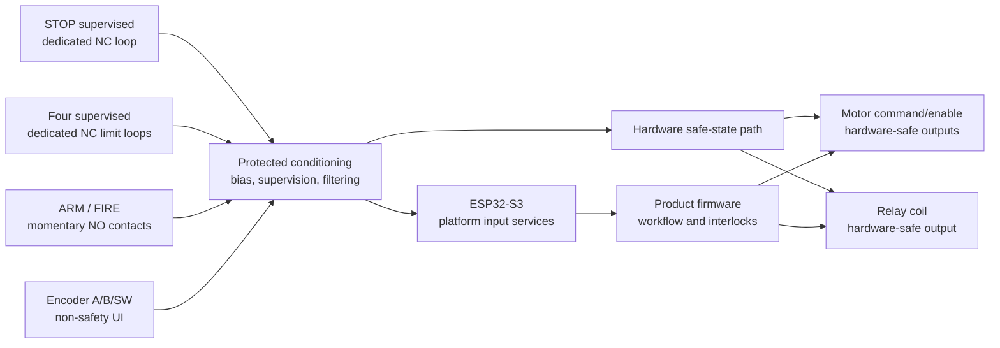
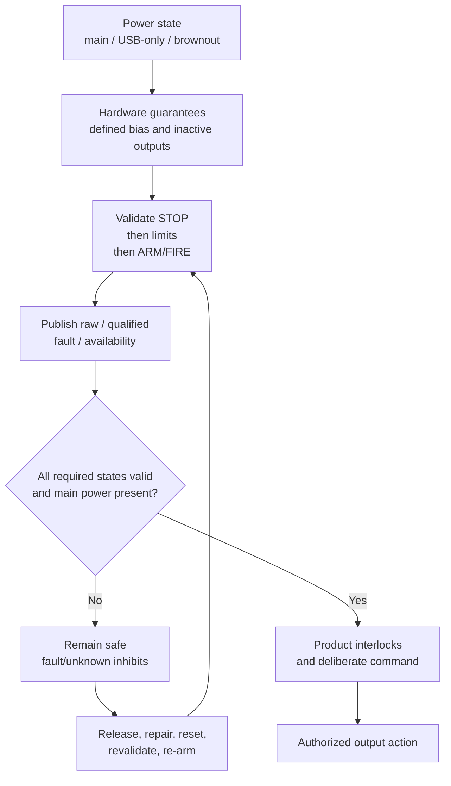

# IPC-100 Rev A Safety Input Electrical Architecture Review

> **ADR-042 amendment (2026-07-30):** The [External Safety Interface Control Document](External_Safety_Interface_Control_Document.md) accepts and controls the Rev A 5 V field standard, 10 m/2 nF cable envelope, contact types, state windows, timing, polarity, fault visibility, and Sheets 04–06 ownership. Its accepted values supersede the architecture-stage `TBD` and “partially satisfied” statements retained below as review history.

| Document control | Value |
| --- | --- |
| Platform | Iron Pine IPC-100 |
| Hardware revision | Rev A |
| Review scope | Controller input electrical architecture |
| Date | 2026-07-29 |
| Status | Interface philosophy complete; quantitative/component design not authorized |
| Owner | Iron Pine Outdoors Engineering |

## 1. Purpose

This review defines the electrical and behavioral contract for every Rev A input before controlled schematic capture. It fixes ownership, classification, signal philosophy, safe states, fault interpretation, power-state behavior, monitoring, and firmware/hardware responsibilities without selecting components, values, connectors, circuits, or GPIOs.

## 2. Scope and input philosophy

Covered inputs are:

- `STOP_IN`;
- `ARM_IN` and `FIRE_IN`;
- `LIMIT_LEFT`, `LIMIT_RIGHT`, `LIMIT_UP`, and `LIMIT_DOWN`;
- `ENCODER_A`, `ENCODER_B`, and `ENCODER_SW`;
- `BATTERY_SENSE`;
- USB VBUS/source presence used by the power/service architecture;
- future reserved input concepts.

IPC-100 inputs are protected electrical interfaces, not direct field-wire-to-processor connections. Safety-related field loops use de-energize-to-safe supervision. Operator commands use validation and sequencing so that a single sampled input is never sufficient to create motion or relay activation. Convenience and diagnostic inputs may fail without defeating hardware-safe outputs.

IPC-100 provides controller-level risk reduction but is not claimed as a certified safety controller or emergency-stop system. Product hazard analysis owns any independent safety device, contactor, mechanical brake, guarded reset, or regulatory function required by the installed machine.

## 3. Electrical ownership

| Element | Owner | Responsibility |
| --- | --- | --- |
| On-board input protection, bias, thresholds, conditioning, supervision interpretation, and processor-domain interface | IPC-100 | Enforce the released electrical contract and protect `+3V3_CORE` |
| Operator switch type, field supervision termination, cable, routing, shield/drain, enclosure, labels, and mechanics | External product | Implement the released loop/contact contract and environmental requirements |
| STOP device accessibility and product-level emergency-stop function | External product | Complete product hazard mitigation; do not represent IPC-100 alone as certified E-stop |
| Directional mapping and physical travel relationship | External product | Map stable limit names to actual mechanisms and validate stopping distance |
| Encoder device and panel mechanics | External product | Provide compatible dry-contact/quadrature behavior and wiring |
| Battery source and J1 harness | External product | Provide compatible power; IPC-100 measures controller input only |
| USB host/cable VBUS | USB host/user | Provide a compliant service connection |
| Input driver, diagnostics, debounce state machines, event handling | IPC-100 base firmware | Interpret released logical states without bypassing hardware-safe output behavior |
| Arming, firing, motion, override, and recovery workflow | Product firmware | Apply product-specific authorization above the platform input service |

No externally powered accessory may use an IPC-100 input to power an unpowered controller.

## 4. Classification and safe-state summary

| Input | Primary classification | Secondary classification | Justification | Hardware-safe interpretation |
| --- | --- | --- | --- | --- |
| `STOP_IN` | Safety Critical | Operational Critical | Must suppress relay and motor authorization regardless of UI/wireless state | Asserted, faulted, or unknown means STOP |
| Four directional limits | Operational Critical | Safety Critical | Prevent motion farther into a physical endpoint; not a complete product safety function | Asserted, faulted, or unknown inhibits motion toward affected direction |
| `ARM_IN` | Operational Critical | User Interface | Begins an authorization sequence but shall not directly energize an output | Inactive/unknown means not armed |
| `FIRE_IN` | Operational Critical | User Interface | Requests a consequential action only after valid arming and other interlocks | Inactive/unknown means no request |
| `ENCODER_A`, `ENCODER_B` | User Interface | Optional | Navigation/adjustment convenience; not permitted as a safety input | Invalid/lost transitions produce no safety action |
| `ENCODER_SW` | User Interface | Optional | Menu/navigation command only | Inactive/unknown means no command |
| `BATTERY_SENSE` | Diagnostic | Operational support | Reports J1 voltage and supports power-state decisions; does not enforce hardware safe states alone | Invalid means measurement unavailable and conservative product policy |
| USB source presence | Diagnostic | Service | Distinguishes bounded USB-only service from main-powered operation | Unknown cannot authorize main operation |
| Reserved input concepts | Future | Optional | No Rev A electrical or behavioral guarantee | Unpopulated/disabled |

“Safety Critical” here describes IPC-100 control priority, not a functional-safety integrity level.

## 5. Common electrical contracts

### 5.1 Field-contact domains

| Contract | Safety-related supervised loop (`STOP_IN`, limits) | Command contact (`ARM_IN`, `FIRE_IN`) | Encoder contact |
| --- | --- | --- | --- |
| Direction | Input to IPC-100 | Input to IPC-100 | Input to IPC-100 |
| Expected source | Passive dry mechanical contact plus approved field supervision termination | Passive, momentary, normally-open dry contact | Passive dry-contact incremental encoder and momentary switch |
| Field voltage | IPC-100-provided limited sensing domain; exact voltage TBD | IPC-100-provided limited sensing domain; exact voltage TBD | IPC-100-provided limited sensing domain; exact voltage TBD |
| Processor domain | Conditioned to `+3V3_CORE`; no direct field connection | Conditioned to `+3V3_CORE`; no direct field connection | Conditioned to `+3V3_CORE`; no direct field connection |
| Isolation | Galvanic isolation not required by baseline; may be selected if cable/environment study requires it | Same | Same |
| Protection | Cable-entry ESD, transient, short-to-ground, short-to-approved-supply, reverse/backfeed, and current-limiting objectives | Same, with lower safety diagnostic demand | Same, optimized for transition integrity |
| Cable class | Product-local low-current harness, separated from motor wiring | Product-local operator-panel harness | Short product-local panel harness preferred |
| Maximum cable length | Numeric maximum TBD before schematic; no universal field-bus claim | Numeric maximum TBD before schematic | Numeric maximum TBD before schematic and likely most restrictive |
| Hot plug | Not assumed | Not assumed | Not assumed |
| Ground/return | Dedicated loop return for each safety-related input; command/encoder returns may share only after fault review | Shared return may be approved | Shared return may be approved |

The final cable limits require product routing, conductor, shielding, EMC, capacitance, transition-rate, and environmental inputs. Leaving the numeric limit open is a schematic blocker, not permission for arbitrary cable length.

### 5.2 State vocabulary

| State | Meaning |
| --- | --- |
| Healthy inactive | Electrical state that proves an intact interface and no operator/limit assertion |
| Asserted | Valid state produced by the intended switch action |
| Fault | Detectable state outside healthy/asserted windows |
| Unknown | Unvalidated startup, transition, reset, power-domain, or ambiguous state |

Safety-related `fault` and `unknown` states are acted upon conservatively. Firmware shall preserve raw electrical state, qualified logical state, fault status, and transition history as separate concepts.

## 6. Per-input electrical contracts

### 6.1 Safety and command inputs

| Input | Purpose / expected active state | Default inactive state | Power / isolation | Noise and cable | Startup / shutdown | Firmware owner | Hardware owner | Safe failure behavior |
| --- | --- | --- | --- | --- | --- | --- | --- | --- |
| `STOP_IN` | Operator intervention; opening the NC supervised loop is asserted | Closed, electrically healthy supervised loop | Main-powered field-sense domain to conditioned core input; no baseline galvanic isolation | Highest immunity; dedicated pair; numeric length TBD | Unknown/asserted until healthy state is stable; loss of main power or conditioning means STOP | Platform STOP service, immediate priority, fault latch/report; product controls guarded recovery | Protected supervised receiver and hardware path capable of forcing relay/motor authorization inactive | Open, invalid, fault, or unknown commands STOP |
| `LIMIT_LEFT` | Physical left-end protection; opening loop asserts left limit | Closed healthy supervised loop | Main-powered field-sense domain; dedicated pair | High immunity; numeric length TBD | Unknown inhibits leftward motion; power loss disables all motion | Platform directional-limit service; product maps direction/mechanics | Protected supervised receiver and directional safe-state support | Fault/unknown inhibits leftward motion |
| `LIMIT_RIGHT` | Physical right-end protection; opening loop asserts right limit | Closed healthy supervised loop | Same | Same | Unknown inhibits rightward motion | Same | Same | Fault/unknown inhibits rightward motion |
| `LIMIT_UP` | Physical upper-end protection; opening loop asserts upward limit | Closed healthy supervised loop | Same | Same | Unknown inhibits upward motion | Same | Same | Fault/unknown inhibits upward motion |
| `LIMIT_DOWN` | Physical lower-end protection; opening loop asserts downward limit | Closed healthy supervised loop | Same | Same | Unknown inhibits downward motion | Same | Same | Fault/unknown inhibits downward motion |
| `ARM_IN` | Momentary normally-open command; closing contact requests entry into armed workflow | Open contact / inactive conditioned state | Main-powered field-sense domain; no isolation baseline | Protected and debounced; numeric length TBD | Held/active or unknown at boot is illegal and shall not arm; power loss clears platform authorization | Platform qualified event; product owns latch/timeout/workflow | Protected biased input with defined reset state | Open/fault/unknown means not armed |
| `FIRE_IN` | Momentary normally-open command; a new closing edge requests action after valid ARM and interlocks | Open contact / inactive conditioned state | Main-powered field-sense domain; no isolation baseline | Protected and debounced; numeric length TBD | Held/active or unknown at boot is illegal; no action until released and reasserted after valid arming | Platform qualified event; product validates sequence and authorization | Protected biased input with defined reset state | Open/fault/unknown means no request |

The names LEFT/RIGHT/UP/DOWN are stable platform names, not a promise about a product’s physical axes.

### 6.2 Encoder, measurement, and service inputs

| Input | Purpose / signal type | Domain and default | Noise / cable | Startup / shutdown | Firmware responsibility | Hardware responsibility | Safe failure behavior |
| --- | --- | --- | --- | --- | --- | --- | --- |
| `ENCODER_A` | Incremental quadrature contact/channel A | Main-powered field-sense to `+3V3_CORE`; biased inactive | Short panel harness; preserve valid phase transitions; numeric length TBD | Ignore until both channels stable; unavailable in USB-only unless explicitly required later | Decode valid Gray-code transitions, reject illegal transitions, rate-limit events, report excessive errors | Protect, bias, condition, and avoid floating states | Freeze/ignore UI adjustment; never create motion or relay action |
| `ENCODER_B` | Incremental quadrature contact/channel B | Same | Same | Same | Same | Same | Same |
| `ENCODER_SW` | Momentary normally-open UI switch | Biased inactive | Contact debounce; numeric length TBD | Held at boot produces no event until release/repress | Qualify press/release/long-press only as product-neutral events | Protect, bias, condition | No command |
| `BATTERY_SENSE` | Analog representation of J1 `VIN_RAW` | Protected high-impedance path to approved ADC; unavailable when main absent | Filter switching/relay/motor-coupled noise without hiding power transitions; on-board path | Mark invalid until ADC/reference/source settle; invalid in USB-only because J1 may be absent | Calibrate, range-check, filter, timestamp, report validity; product interprets battery status | Bound ADC voltage/current and prevent phantom powering during all power states | Invalid/out-of-range diagnostic; cannot alone authorize outputs |
| USB source presence | Internal source-state/digital indication derived from protected VBUS or power-path status | `USB_5V_PROTECTED` / core domain; absent is inactive | On-board only | Valid in bounded USB-only and simultaneous-source states; removal handled by power architecture | Select service-mode behavior and report source state | Protect VBUS and expose reliable source status if required by implementation | Unknown/USB-only cannot authorize main-powered outputs |
| Future reserved input | No released signal | Unpopulated/disabled | No cable assumption | Ignored | No Rev A service | Keep undefined concepts from floating into firmware | No effect |

USB source presence may be implemented through source/power-path status rather than a dedicated processor input. No GPIO resource is claimed by this review.

## 7. STOP architecture

### 7.1 Contact and supervision philosophy

`STOP_IN` uses a normally-closed, de-energize-to-safe, individually returned, supervised dry-contact loop. The product places the approved passive supervision termination at the field switch/end of line. IPC-100 distinguishes at least:

- healthy closed loop;
- intentional open/STOP or broken wire;
- short-circuit/invalid loop state where achievable under the approved supervision contract.

An open circuit is both a STOP demand and a diagnostic condition unless an operator action explains it. A short that could mask switch opening is a latched fault and shall prevent operation. Exact state windows, field termination, stimulus method, and diagnostics are schematic decisions.

### 7.2 Behavior

- Reset, boot, watchdog recovery, brownout, loss of input conditioning, unknown state, and USB-only service all produce the STOP-safe interpretation.
- STOP forces relay-coil authorization off and all motor-driver commands/enables inactive through the approved hardware-safe output architecture.
- Firmware receives STOP with highest input priority, cancels active platform command authorization, records the event/fault, and does not depend on display, wireless, I2C, encoder, or product application timing.
- Debounce is shared: hardware rejects damaging/high-frequency interference; platform firmware qualifies contact bounce. Neither may delay the hardware-safe response beyond an approved limit.
- A healthy electrical loop alone does not resume operation. Recovery requires stable healthy state, cleared electrical fault, released ARM/FIRE, platform reinitialization, and product-defined deliberate operator reset/re-arm.
- STOP shall not be bypassed by a manual override. Any product maintenance motion requires an independent, documented product safety mode outside the IPC-100 base contract.
- A maintained mechanical STOP device may be used by a product if it preserves the NC supervised electrical contract and deliberate mechanical release. IPC-100 does not assume a specific actuator form.

## 8. Directional-limit architecture

Each limit is an individually returned, normally-closed, supervised dry-contact loop. Separate returns prevent a single shared-return break from silently changing or disabling two directional channels and improve cross-fault diagnosis. Consequently, the current J4/J5 three-pin shared-return reservations are not releasable; each pair requires four logical conductors unless a later reviewed architecture provides equivalent independence and diagnostics.

Behavior:

- opening a loop, wire break, invalid supervision state, or unknown startup state asserts/faults that directional limit;
- an asserted limit inhibits only motion farther into that endpoint; motion away may be permitted by product logic after all other interlocks are satisfied;
- opposite limits asserted simultaneously are an illegal state, inhibit that axis in both directions, and create a diagnostic fault;
- unexpected activation during motion immediately removes authorization toward the asserted direction and records the event;
- a stuck-active limit prevents travel toward that direction; a stuck-inactive/shorted loop shall be detectable by supervision or prototype proof testing and blocks release if it can mask the endpoint;
- mechanical bounce is conditioned in hardware and qualified in platform firmware without allowing repeated motion commands;
- startup requires stable qualified states before motion authorization;
- power loss, reset, brownout, or watchdog recovery disables all motion independent of limit samples;
- automatic recovery does not restart motion. A new valid product command is required;
- manual override may never electrically bypass the limit. Product maintenance movement away from an asserted limit may be allowed only through a separately controlled, speed/energy-limited product procedure.

Stopping distance, switch placement, overtravel, mechanical robustness, and whether a second independent hard stop is required belong to the product.

## 9. ARM and FIRE architecture

ARM and FIRE use momentary, normally-open, passive dry contacts. They are operationally critical commands but are not safety-loop substitutes.

- ARM creates a qualified platform event; product firmware may enter an armed state only after STOP and limit validity, output-safe state, main-power validity, and product interlocks pass.
- FIRE creates a request only on a new qualified press after a valid arm sequence. A maintained/held FIRE input shall never repeatedly fire or become valid merely because ARM later changes.
- STOP always cancels or blocks ARM/FIRE authorization.
- FIRE without prior ARM, simultaneous ARM/FIRE at startup, either input held at startup, impossible transition timing, or a detected electrical fault is illegal and produces no output action.
- Power loss, brownout, reset, watchdog reset, processor crash recovery, and transition to USB-only service clear platform authorization and require release plus a new sequence.
- Wire open/floating/stuck-inactive produces no command. Short/stuck-active is detectable as a held illegal state through startup and release-before-rearm rules.
- Hardware provides defined inactive bias and input protection. Firmware provides qualified edges, debounce, ordering, timeouts, stale-state rejection, and diagnostics. Product firmware owns operator prompts, arm duration, firing semantics, and additional interlocks.

## 10. Encoder architecture

The encoder is a non-safety local UI device. A passive incremental quadrature encoder with a normally-open push switch is the reference electrical behavior; an approved future replacement may use another interface behind the platform abstraction.

- Hardware conditions all three channels and prevents floating processor inputs.
- Firmware decodes only valid quadrature sequences, rejects impossible transitions, bounds event rate, and exposes diagnostic counters.
- Contact bounce and noise may lose or add UI detents but shall not directly command relay or motor outputs.
- Loss/disconnection freezes or disables encoder-based adjustment and reports a diagnostic where detectable.
- Recovery occurs after stable valid transitions; no safety reset or automatic output action follows.
- Encoder handling may use interrupts, hardware pulse counting, or polling after processor/GPIO allocation. No implementation is selected here.
- Numeric cable length, transition bandwidth, filtering, and debounce limits require the actual encoder and harness.

## 11. Common input-fault behavior

| Condition | Hardware responsibility | Firmware / diagnostic responsibility | Result |
| --- | --- | --- | --- |
| Open circuit | Defined bias; supervised safety loops distinguish from healthy | STOP/limit: assert and fault; commands/UI: inactive or disconnected diagnostic | Conservative safe state |
| Short to return/ground | Limit injected current; supervision where required | STOP/limit: fault if outside healthy window; commands: held-state detection | No authorization from fault |
| Short to approved supply | Protect processor domain and prevent backfeed | Mark invalid/fault | Affected function unavailable/safe |
| Floating input | Hardware bias prevents undefined processor state | Report instability if observable | Never interpreted as valid command |
| Noise/transient | Entry protection and analog/digital conditioning | Temporal qualification and error counters | No false persistent command |
| Mechanical bounce | Hardware bandwidth limitation where required | Debounce/state qualification | One qualified event at most |
| Stuck active | Electrical supervision or duration observation | Latch/report; require release before recovery | STOP/limit safe; ARM/FIRE no repeat |
| Stuck inactive | Supervision/proof test where architecture supports it | Detect missing expected activity where meaningful | Safety-loop short fault blocks release; command/UI simply unavailable |
| Processor reset/watchdog | Passive input states and hardware-safe outputs remain valid | Reinitialize from unknown, clear authorizations, retain/report cause | No automatic output restart |
| Brownout | Conditioning/output hardware moves safe before logic is unreliable | Clean restart after valid rails | Relay off, motion disabled |
| USB-only operation | Main field-sense domains remain off; no external backfeed | Inputs reported unavailable/STOP-safe; service only | No main-powered outputs |
| Externally powered accessory | Block injection into rails/input structures | Report invalid state if detectable | No phantom-powered controller |
| Unexpected disconnect | Supervision/bias defines state | STOP/limit fault; command/UI unavailable | Safe degradation |

## 12. Startup and recovery sequence

1. Passive hardware holds relay and motor outputs inactive before any input is read.
2. Source state and `+3V3_CORE` validity are established.
3. Reset cause is captured; all logical inputs begin `unknown`.
4. USB-only source state enters service mode and leaves all main field inputs unavailable/STOP-safe.
5. Under valid main power, STOP conditioning initializes first and must prove a stable healthy state.
6. Four limit loops initialize and must produce stable healthy/asserted states without invalid supervision faults.
7. ARM and FIRE initialize inactive; either held input is illegal until released.
8. Battery measurement is validated and marked with source/range status.
9. Encoder initializes after safety and command inputs; its failure is nonblocking to safe platform startup.
10. Diagnostics publish raw, qualified, fault, and availability states.
11. Platform output authorization remains disabled until input validation completes.
12. Product firmware may begin its own interlock and operator workflow; no output resumes automatically after recovery.

Illegal or unknown safety-related states keep the affected safe inhibition active. Clearing a fault never replays a stale command.

## 13. Shutdown behavior

| Event | Required behavior |
| --- | --- |
| Normal shutdown | Disable relay/motor authorization first, stop accepting ARM/FIRE, mark inputs unavailable, then remove switched field domains |
| Main power removal | Hardware outputs become inactive during decay; field inputs become unavailable/STOP-safe; USB may retain service core only |
| Brownout | Output gating/reset precedes unreliable execution; all authorizations clear |
| USB disconnect | Main operation continues if valid; USB-only service powers down with no external outputs active |
| Watchdog reset / processor crash | Passive safe outputs persist; all inputs restart unknown and authorization clears |
| Accessory disconnect | STOP/limit becomes asserted/faulted; ARM/FIRE/encoder becomes unavailable/inactive according to contract |
| External power on an input while off | Protection blocks rail injection; no valid input is claimed |

## 14. Architecture diagrams

These are behavioral blocks, not circuits.

## 15. Remaining design decisions

| Stage | Decision |
| --- | --- |
| Must resolve before schematic | Approve numeric field-sense voltage domain and allowed short/miswiring voltages |
| Must resolve before schematic | Approve supervision states and field end-of-line contract for STOP and four limits |
| Must resolve before schematic | Revise J4/J5 to individually returned loops and decide physical partition of STOP from mixed J8 |
| Must resolve before schematic | Define maximum cable length/environment for STOP, limits, commands, and encoder |
| Must resolve before schematic | Approve input protection/EMC objectives and whether any interface requires galvanic isolation |
| Must resolve before schematic | Define hardware path by which STOP/invalid main power forces relay and motor authorization inactive |
| May resolve during schematic | Select conditioning, bias, supervision, filtering, threshold, and test-point implementations |
| May resolve during schematic | Define exact short/open diagnostic windows and processor-facing logic polarity |
| May resolve during schematic | Allocate supervision/fault readback resources without assigning GPIO in this review |
| Prototype validation | Measure bounce, noise margin, cable susceptibility, threshold tolerance, response time, and fault detection |
| Prototype validation | Verify shorts, opens, cross-shorts, external power, source transitions, reset, watchdog, and brownout |
| Future revision | Alternative encoder technology, isolated field inputs, longer-distance signaling, or redundant safety channels |

## 16. Schematic-entry assessment

| Criterion | Status | Evidence / blocker |
| --- | --- | --- |
| Input inventory and ownership | Satisfied | Sections 2–3 |
| Safety/operational/UI/diagnostic classification | Satisfied | Section 4 |
| STOP safe-state and contact philosophy | Satisfied at architecture level | NC supervised dedicated loop |
| Limit safe-state and contact philosophy | Satisfied at architecture level | Four independently returned NC supervised loops |
| ARM/FIRE command and sequence philosophy | Satisfied | Momentary NO, release/edge/sequence validation |
| Encoder non-safety contract | Satisfied | Section 10 |
| Battery/USB diagnostic input contracts | Satisfied at architecture level | Section 6.2 |
| Common startup/shutdown/fault behavior | Satisfied | Sections 11–13 |
| J4/J5 conductor architecture | Partially Satisfied | Four logical conductors are documented; physical connector/harness implementation remains open |
| STOP physical connector partition | Partially Satisfied | Dedicated electrical pair required; J8 partition remains open |
| Field voltage and cable limits | Not Satisfied | Product/environment inputs absent |
| Supervision state windows/termination | Partially Satisfied | Philosophy fixed; quantitative contract open |
| Protection and isolation objectives | Partially Satisfied | Hazards defined; numeric environment/isolation decision open |
| STOP-to-output hardware mechanism | Partially Satisfied | Required behavior fixed; mechanism open |
| Input GPIO allocation | Not Satisfied | Intentionally deferred to processor allocation |

**Input architecture maturity:** Interface philosophy substantially complete; physical conductor, quantitative electrical, and implementation decisions remain.  
**Input schematic readiness:** Not ready for released schematic capture.  
**Overall IPC-100 schematic readiness:** Not ready.

The recommended next package is **Rev A Field Input Quantitative Requirements and Connector Partition Review**. It shall close field voltage/miswiring profiles, cable/environment assumptions, supervision windows/termination, independent conductor allocation, STOP connector partition, response/debounce criteria, and the required hardware inhibit interface before component selection.

## 17. Files reviewed

- `README.md`
- `docs/architecture/System_Architecture.md`
- `docs/architecture/Design_Decisions.md`
- `docs/architecture/Processor_Selection_Study.md`
- `docs/architecture/Processor_Resource_Feasibility.md`
- `docs/requirements/Functional_Requirements.md`
- `docs/requirements/Hardware_Requirements.md`
- `docs/power/Power_Architecture.md`
- `docs/power/Power_Architecture_Engineering_Review.md`
- `docs/connectors/Connector_Specification.md`
- `docs/connectors/GPIO_Map.md`
- `docs/revisions/Schematic_Readiness_Review_Rev_A.md`
- `docs/revisions/Open_Design_Items.md`
- `docs/revisions/Revision_History.md`

## 18. Related documents

- [System Architecture](../architecture/System_Architecture.md)
- [Hardware Requirements](../requirements/Hardware_Requirements.md)
- [Connector Specification](../connectors/Connector_Specification.md)
- [GPIO Map](../connectors/GPIO_Map.md)
- [Power Architecture Engineering Review](../power/Power_Architecture_Engineering_Review.md)
- [Schematic Readiness Review](../revisions/Schematic_Readiness_Review_Rev_A.md)

## 19. Review output summary

Created:

- `docs/interfaces/README.md`
- `docs/interfaces/Safety_Input_Architecture_Review.md`

Updated:

- repository navigation and system architecture;
- hardware input requirements;
- connector specification and connector architecture review;
- GPIO resource-planning notes without assigning pins;
- power-state input behavior;
- open design items and requirements traceability;
- design decisions and revision history;
- schematic-readiness classifications and test coverage.

The principal remaining risks are an undefined field electrical environment, quantitative supervision/response criteria, STOP hardware-inhibit implementation, connector/harness partitioning, and proof that short/cross-fault detection meets the product hazard analysis. The architecture improves readiness by fixing contact type, default/fault interpretation, ownership, sequencing, and conductor independence. It intentionally stops before component-level design.
