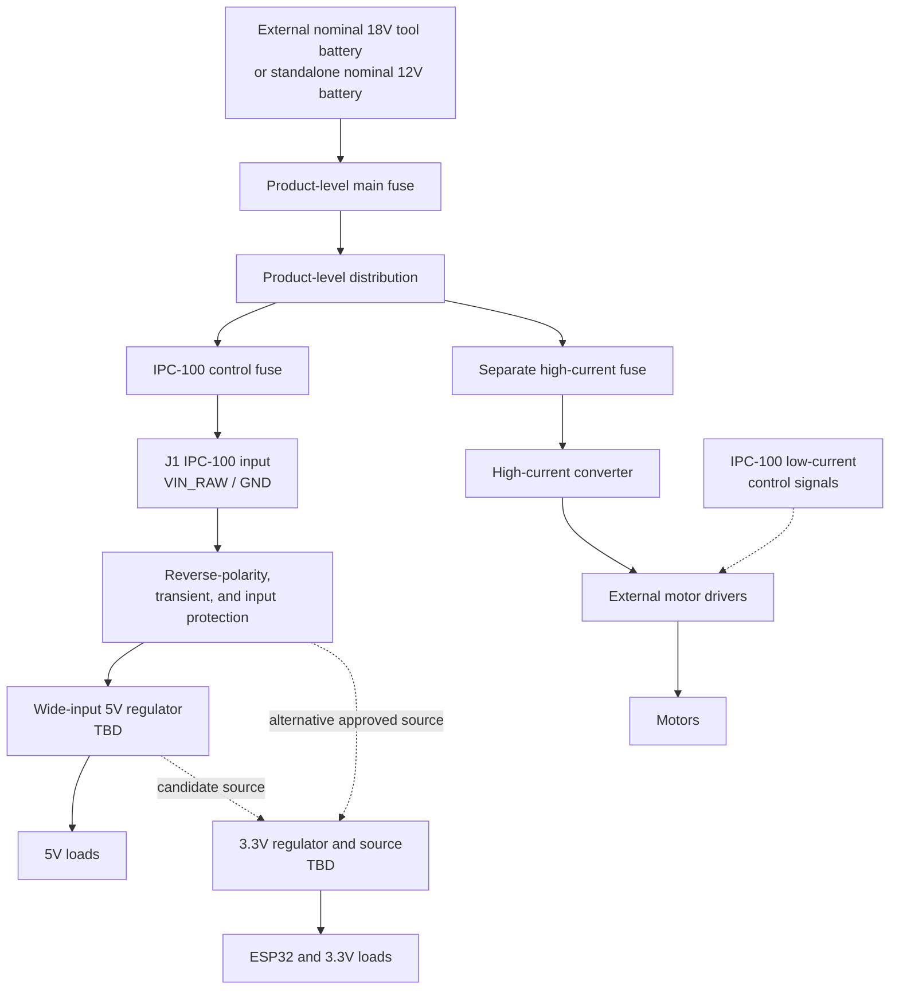

# IPC-100 Power Architecture

> **QER-01 control notice (2026-07-31):** [QER-01 Quantitative Electrical Requirements](../specifications/QER-01_Quantitative_Electrical_Requirements.md) supplies the controlling numeric environment, rail, load, transient, protection, connector, and derating envelope. This document continues to control the architectural power boundaries and ownership.

| Document control | Value |
| --- | --- |
| Document title | IPC-100 Power Architecture |
| Platform | Iron Pine IPC-100 |
| Hardware revision | Rev A |
| Document status | Architecture and requirements definition |
| Last updated | 2026-07-29 |
| Owner | Iron Pine Outdoors Engineering |

## 1. Purpose

This document defines the Rev A control-power boundary and design baseline. The [Power Architecture Engineering Review](Power_Architecture_Engineering_Review.md) is the authoritative state, ownership, fault, USB, sequencing, and schematic-entry review. This document does not define product battery mounting or high-current motor distribution.

## 2. Product-level source architecture

The primary Rev A integration case is an external nominal 18 V lithium-ion tool-battery system with a maximum normal voltage no greater than 21 V DC. DeWalt 20V MAX is the initial reference implementation, not a platform dependency. A standalone nominal 12 V battery system is the secondary intended source.

The product supplies the battery mount, main fuse, high-current distribution, branch fuses, high-current converter, motor drivers, motor power wiring, and external power for circuits switched by the relay contacts.

Normal IPC-100 operation is 9–21 V DC. Normal operation and transient survival are separate requirements; the transient-survival profile is `TBD`. Direct connection to a vehicle charging system and automotive load-dump qualification are outside the approved Rev A baseline unless separately added as requirements.

## 3. Power tree

## 4. Voltage domains

| Domain | Nominal range | Source | Loads | Status |
| --- | --- | --- | --- | --- |
| `VIN_RAW` | 9–21 V DC normal operation | J1 after product control fuse | Input protection, regulator input, battery divider | Locked normal range; transient survival TBD |
| `VIN_PROTECTED` | TBD | Input protection stage | Main 5 V regulation | Block fixed; implementation and abnormal-input profile TBD |
| `+5V_MAIN` | 5 V | Wide-input regulation from `VIN_PROTECTED` | Relay coil branch, limited main-powered interface loads, core-source selector | Main-only rail; regulator TBD |
| `USB_5V_PROTECTED` | 5 V nominal | USB host through protected reverse-blocking entry | Core-source selector only | Service-only source; implementation TBD |
| `CORE_SOURCE` | TBD | Non-backfeeding selection of `+5V_MAIN` or `USB_5V_PROTECTED` | 3.3 V core regulation | Source priority/transition implementation TBD |
| `+3V3_CORE` | 3.3 V | 3.3 V regulator from `CORE_SOURCE` | ESP32-S3 and essential logic | Available from main or bounded USB service power |
| `OLED_VCC` / `SENSOR_VCC` | 3.3 V | Separately switched `+3V3_CORE`, qualified by main validity | Approved OLED/environmental sensor | Main-only, request-controlled, default-off |
| `UI_VCC` | 5 V | Switched `+5V_MAIN` | Approved UI loads only | Main-only, request-controlled, default-off |
| `FIELD_SENSE_VCC` | 5 V | Hardware-enabled qualified `+5V_MAIN` branch | Supervised field-contact loops | Main-only; available before firmware initialization |
| `EXPANSION_VCC` | 3.3 V | Protected switched `+3V3_CORE`, qualified by main validity | Approved J10 expansion only | Main-only, request-controlled, optional/DNP, 100 mA maximum |
| External high-current | Product-defined | Separately fused product branch | Converter, motor drivers, motors | Off-board |
| Relay-contact load | Product-defined | Product-level external source | External circuit switched through isolated contacts | Off-board; not supplied by IPC-100 |

## 5. IPC-100 power entry

J1 carries only `VIN_RAW` and `GND` for controller power. The product control fuse should be placed upstream, near the distribution point. IPC-100 shall include local protection appropriate to board conductors and components. The exact connector, current rating, local fuse, and inrush limits are `TBD`.

## 6. Grounding philosophy

- IPC-100 uses a controlled `GND` reference for logic and low-current external interfaces.
- Motor current and high-current converter return current must not flow through the PCB or IPC-100 harness return.
- External motor drivers may require a logic reference to IPC-100; that conductor is not a motor-power return.
- USB shield, chassis coupling, and cable-shield terminations are `TBD`.
- Analog battery measurement return should be routed to minimize switching and relay-coil error.

## 7. Protection requirements

### 7.1 Reverse polarity

The final reverse-polarity topology is `TBD`. A P-channel MOSFET or alternative implementation may be evaluated, but no device is selected. The circuit must tolerate the approved reverse-input condition without unsafe heating or downstream reverse voltage.

### 7.2 Fuse philosophy

- The product provides a main fuse near the battery source.
- The product provides an IPC-100 control-branch fuse.
- Each product high-current branch is independently fused.
- On-board supplemental protection may be used for PCB traces or limited interface-power outputs.
- Fuse types, ratings, interrupt capacity, and coordination are `TBD`.

### 7.3 TVS protection

The final TVS part, standoff voltage, clamp voltage, pulse rating, and placement are `TBD`. Selection requires the approved transient profile and downstream absolute maximum ratings.

### 7.4 Input filtering

Input capacitance, differential filtering, common-mode filtering, damping, and inrush control are `TBD`. The network must be analyzed with the product wiring impedance and regulator stability requirements.

## 8. 5 V rail

The 5 V regulator shall be selected from the approved power budget and verified 5 V rail loading. Separately, the IPC-100 input power path has a preliminary design target of at least 2.0 A continuous controller-side current at 9 V, pending thermal and power-budget approval.

The final 5 V regulator is `TBD`. MP1584 is not selected for Rev A and must not be treated as an approved design choice. Exact input/output capacitance, inductance, compensation, switching frequency, and protection features are `TBD`.

## 9. 3.3 V rail

The 3.3 V regulator supplies ESP32 and essential logic loads from the non-backfeeding `CORE_SOURCE`. ADR-039 fixes `CORE_SOURCE` as the main-priority selection of `+5V_MAIN` or `USB_5V_PROTECTED` and fixes `+3V3_CORE` at 3.3 V. TPS62130 remains the selected preliminary-capture converter; its detailed passive, layout, tolerance, and thermal implementation remains subject to capture review.

### 9.1 Controlled branch domains

ADR-039 fixes `OLED_VCC` and `SENSOR_VCC` as main-qualified switched 3.3 V, `UI_VCC` as main-qualified switched 5 V, `FIELD_SENSE_VCC` as hardware-enabled main-only 5 V, and `EXPANSION_VCC` as optional protected switched 3.3 V. Sheet 03 requests the OLED, sensor, UI, and expansion branches with active-high signals; Sheet 02 supplies hardware pull-down defaults and main-power qualification.

`RELAY_VCC` and `MOTOR_LOGIC_5V_A/B` are hardware-enabled main-only 5 V branches. Their electrical presence never constitutes actuator authorization.

## 10. USB power interaction

J13 provides native ESP32-S3 USB Serial/JTAG programming and diagnostics. USB VBUS may power a bounded core service domain through protected, non-backfeeding source selection. USB is not a battery charger, product-power input, USB host, Power Delivery implementation, or source of external interface power.

- Main power supplies `+5V_MAIN`, `CORE_SOURCE`, `+3V3_CORE`, and sequenced main loads.
- USB only supplies `USB_5V_PROTECTED`, `CORE_SOURCE`, and `+3V3_CORE` for programming, console, JTAG, and recovery.
- USB-only operation shall not energize relay, motor-driver logic power, OLED, sensor, UI-accessory, or expansion-power domains.
- With both sources present, source selection prevents current between them and main power owns all main-only loads.
- USB removal shall not disturb valid main-powered operation; main removal with USB present transitions to bounded service mode without keeping main-powered outputs active.
- No connection order may backfeed the host, J1, product battery, external drivers, accessories, or unpowered rails.

The protection, source-selection, transition-continuity, CC, shield, reset/recovery, and VBUS-sensing implementations remain schematic decisions.

## 11. Battery-voltage measurement

`BATTERY_SENSE` is derived from `VIN_RAW` through a protected divider and filter into an ADC1-capable processor input or another approved ADC path. ADC2 availability shall not be assumed during active Wi-Fi operation unless verified for the selected processor. Divider values, ADC full-scale margin, input protection, measurement accuracy, resolution, filter bandwidth, calibration method, allowable error, leakage error, and acceptable source impedance are `TBD`.

## 12. Power-status indicators

Power-present and rail-status indicators may be provided where their current and light leakage are acceptable. Which rails receive indicators, LED current, colors, and interaction with enclosure visibility are `TBD`. Indicators do not replace electrical test points or power-good supervision.

## 13. Test points

Provide labeled test access for at least:

- `VIN_RAW`
- Protected input after reverse/transient protection
- `+5V_MAIN`
- `USB_5V_PROTECTED`
- `CORE_SOURCE`
- `+3V3_CORE`
- `GND`
- `BATTERY_SENSE`
- Regulator enable and power-good signals when used
- USB VBUS after protection

Exact reference designators and probe geometry are `TBD`.

## 14. Noise segregation

Keep input switching loops, regulator switch nodes, relay-coil current, digital edges, analog battery sensing, ESP32 antenna clearance, and external cable entries separated according to their noise risk. Do not route sensitive analog signals beneath inductors or switch nodes. Final placement and return-path rules require schematic and PCB review.

## 15. Motor-noise isolation

Motor power is on a separately fused external branch, and motor current must not pass through IPC-100. IPC-100 sends only low-current controls to external drivers. Any motor-driver connector `+5V` provision is a limited logic/interface supply subject to the approved power budget, not motor power. Product wiring must separate motor leads from logic wiring and provide suppression at the source appropriate to the selected drivers and motors.

## 16. Brownout behavior

Motor enables shall remain disabled and the relay coil shall remain de-energized, with `RELAY_NO` open, during undervoltage, reset, and uncontrolled rail decay. ESP32 brownout supervision, regulator undervoltage behavior, external enable gating, and brownout shutdown thresholds are `TBD`.

## 17. Startup and shutdown

Hardware pulls and gating shall establish safe outputs before firmware initialization. A common hardware master inhibit overrides all motor commands/enables and relay-coil authorization during STOP, invalid main power, reset, brownout, watchdog recovery, USB-only service, and uninitialized operation. Valid `CORE_SOURCE` establishes `+3V3_CORE`; the processor then validates source/reset state and safety inputs before any main-powered peripheral or external supply branch is enabled. Main-powered STOP, limit, command, and encoder conditioning remains unavailable during USB-only service; STOP and limits receive their conservative safe interpretation, while ARM, FIRE, and encoder commands remain unavailable. RGB remains off, the buzzer silent, and OLED reset asserted/non-driving until their main-powered domains and interfaces are valid. Numeric rail timing and enable/discharge implementation remain `TBD`. Shutdown shall disable commands before controllable loads where firmware can run and shall remain passively safe when it cannot.

Optional expansion shall initialize only after hardware-safe outputs and safety-relevant local inputs are established. Expansion power outputs require current limiting, protection, budget allocation, and fault containment; exact limits and implementation remain `TBD`. Externally powered expansion or communications modules shall not backfeed controller rails, USB, GPIO, or other interfaces. External field-bus power may require a product-level supply.

## 18. Thermal considerations

Regulator, protection, relay-coil, indicator, and interface losses shall be evaluated at minimum and maximum input, verified peak load, and the approved ambient/enclosure conditions. Copper spreading, airflow assumptions, component derating, and maximum permitted temperature rise are `TBD`.

## 19. Open component selections

| Item | Status |
| --- | --- |
| Final reverse-polarity topology | TBD |
| Final P-channel MOSFET or alternative device | TBD |
| Final TVS part | TBD |
| Final 5 V buck regulator | TBD |
| Final 3.3 V regulator and rail source | TBD |
| USB backfeed-prevention method | TBD |
| Exact input and output capacitor values | TBD |
| Battery-divider resistor values | TBD |
| Power-good supervision | TBD |
| Brownout shutdown thresholds | TBD |

## 20. Related documents

- [Power Budget](Power_Budget.md)
- [Power Architecture Engineering Review](Power_Architecture_Engineering_Review.md)
- [Hardware Requirements](../requirements/Hardware_Requirements.md)
- [System Architecture](../architecture/System_Architecture.md)
- [Connector Specification](../connectors/Connector_Specification.md)
