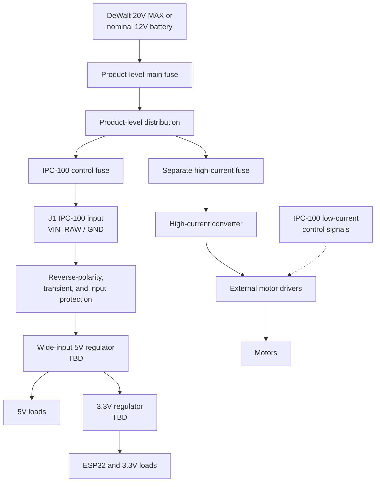

# IPC-100 Power Architecture

| Document control | Value |
| --- | --- |
| Document title | IPC-100 Power Architecture |
| Platform | Iron Pine IPC-100 |
| Hardware revision | Rev A |
| Document status | Architecture and requirements definition |
| Last updated | 2026-07-28 |
| Owner | Iron Pine Outdoors Engineering |

## 1. Purpose

This document defines the Rev A control-power boundary and the design requirements that must be resolved before the power schematic is released. It does not define product battery mounting or high-current motor distribution.

## 2. Product-level source architecture

IPC-100 is intended for a DeWalt 20V MAX battery system or nominal 12 V battery system. The product supplies the battery mount, main fuse, high-current distribution, branch fuses, high-current converter, and motor power wiring.

Normal IPC-100 input is 9–21 V DC. The final abnormal and transient input profile is `TBD`.

## 3. Power tree

## 4. Voltage domains

| Domain | Nominal range | Source | Loads | Status |
| --- | --- | --- | --- | --- |
| `VIN_RAW` | 9–21 V DC normal | J1 after product control fuse | Input protection, buck input, battery divider | Locked range |
| Protected input | TBD | Input protection stage | 5 V buck | TBD |
| `+5V` | 5 V | Wide-input buck | Relay coil, optional interface loads, 3.3 V regulator input, other verified 5 V loads | Regulator TBD |
| `+3V3` | 3.3 V | 3.3 V regulator | ESP32, logic, BME280, I2C, verified expansion loads | Regulator TBD |
| USB VBUS | 5 V nominal | USB host | Programming/diagnostics path | Interaction TBD |
| External high-current | Product-defined | Separately fused product branch | Converter, motor drivers, motors | Off-board |

## 5. IPC-100 power entry

J1 carries only `VIN_RAW` and `GND` for controller power. The product control fuse should be placed upstream, near the distribution point. IPC-100 shall include local protection appropriate to board conductors and components. The exact connector, current rating, local fuse, and inrush limits are `TBD`.

## 6. Grounding philosophy

- IPC-100 uses a controlled `GND` reference for logic and low-current external interfaces.
- Motor current and high-current converter return current must not flow through the PCB or IPC-100 harness return.
- External motor drivers may require a logic reference to IPC-100; that conductor is not a motor-power return.
- USB shield, chassis coupling, and cable-shield terminations are `TBD`.
- Analog battery measurement return should be routed to minimize switching and relay-coil error.

## 7. Protection requirements

### 7.1 Reverse polarity

The final reverse-polarity topology is `TBD`. A P-channel MOSFET or alternative implementation may be evaluated, but no device is selected. The circuit must tolerate the approved reverse-input condition without unsafe heating or downstream reverse voltage.

### 7.2 Fuse philosophy

- The product provides a main fuse near the battery source.
- The product provides an IPC-100 control-branch fuse.
- Each product high-current branch is independently fused.
- On-board supplemental protection may be used for PCB traces or limited interface-power outputs.
- Fuse types, ratings, interrupt capacity, and coordination are `TBD`.

### 7.3 TVS protection

The final TVS part, standoff voltage, clamp voltage, pulse rating, and placement are `TBD`. Selection requires the approved transient profile and downstream absolute maximum ratings.

### 7.4 Input filtering

Input capacitance, differential filtering, common-mode filtering, damping, and inrush control are `TBD`. The network must be analyzed with the product wiring impedance and regulator stability requirements.

## 8. 5 V rail

The 5 V rail is generated by a wide-input buck regulator selected for the verified 9–21 V operating range, transient margin, approximately 2 A controller input target, rail peak load, efficiency, thermal environment, availability, and layout constraints.

The final 5 V regulator is `TBD`. MP1584 is not selected for Rev A and must not be treated as an approved design choice. Exact input/output capacitance, inductance, compensation, switching frequency, and protection features are `TBD`.

## 9. 3.3 V rail

The 3.3 V regulator supplies ESP32 and logic loads. Selection must account for wireless transmit peaks, dropout from the 5 V rail, quiescent current, transient response, thermal dissipation, and expansion reserve. The regulator and capacitor values are `TBD`.

## 10. USB power interaction

J13 provides USB programming and diagnostics. USB power must not backfeed the host, `+5V`, `VIN_RAW`, or an unpowered product system. The USB backfeed-prevention and source-selection method is `TBD`. The controller's permitted functionality on USB-only power is also `TBD`.

## 11. Battery-voltage measurement

`BATTERY_SENSE` is derived from `VIN_RAW` through a protected divider and filter into an ADC1-capable ESP32 input. Divider values, ADC full-scale margin, input protection, filter bandwidth, calibration method, leakage error, and acceptable source impedance are `TBD`.

## 12. Power-status indicators

Power-present and rail-status indicators may be provided where their current and light leakage are acceptable. Which rails receive indicators, LED current, colors, and interaction with enclosure visibility are `TBD`. Indicators do not replace electrical test points or power-good supervision.

## 13. Test points

Provide labeled test access for at least:

- `VIN_RAW`
- Protected input after reverse/transient protection
- `+5V`
- `+3V3`
- `GND`
- `BATTERY_SENSE`
- Regulator enable and power-good signals when used
- USB VBUS after protection

Exact reference designators and probe geometry are `TBD`.

## 14. Noise segregation

Keep input switching loops, regulator switch nodes, relay-coil current, digital edges, analog battery sensing, ESP32 antenna clearance, and external cable entries separated according to their noise risk. Do not route sensitive analog signals beneath inductors or switch nodes. Final placement and return-path rules require schematic and PCB review.

## 15. Motor-noise isolation

Motor power is on a separately fused external branch. IPC-100 sends only low-current controls to external drivers. Product wiring must separate motor leads from logic wiring and provide suppression at the source appropriate to the selected drivers and motors.

## 16. Brownout behavior

Motor enables shall remain disabled and relay contacts shall remain de-energized/open during undervoltage, reset, and uncontrolled rail decay. ESP32 brownout supervision, regulator undervoltage behavior, external enable gating, and brownout shutdown thresholds are `TBD`.

## 17. Startup and shutdown

Hardware pulls shall establish safe outputs before firmware initialization. Startup sequencing among protected input, 5 V, 3.3 V, ESP32 enable, and external interface power is `TBD`. Shutdown shall not create motor-enable pulses, relay actuation, USB backfeed, or out-of-range input injection through unpowered interfaces.

## 18. Thermal considerations

Regulator, protection, relay-coil, indicator, and interface losses shall be evaluated at minimum and maximum input, verified peak load, and the approved ambient/enclosure conditions. Copper spreading, airflow assumptions, component derating, and maximum permitted temperature rise are `TBD`.

## 19. Open component selections

| Item | Status |
| --- | --- |
| Final reverse-polarity topology | TBD |
| Final P-channel MOSFET or alternative device | TBD |
| Final TVS part | TBD |
| Final 5 V buck regulator | TBD |
| Final 3.3 V regulator | TBD |
| USB backfeed-prevention method | TBD |
| Exact input and output capacitor values | TBD |
| Battery-divider resistor values | TBD |
| Power-good supervision | TBD |
| Brownout shutdown thresholds | TBD |

## 20. Related documents

- [Power Budget](Power_Budget.md)
- [Hardware Requirements](../requirements/Hardware_Requirements.md)
- [System Architecture](../architecture/System_Architecture.md)
- [Connector Specification](../connectors/Connector_Specification.md)
