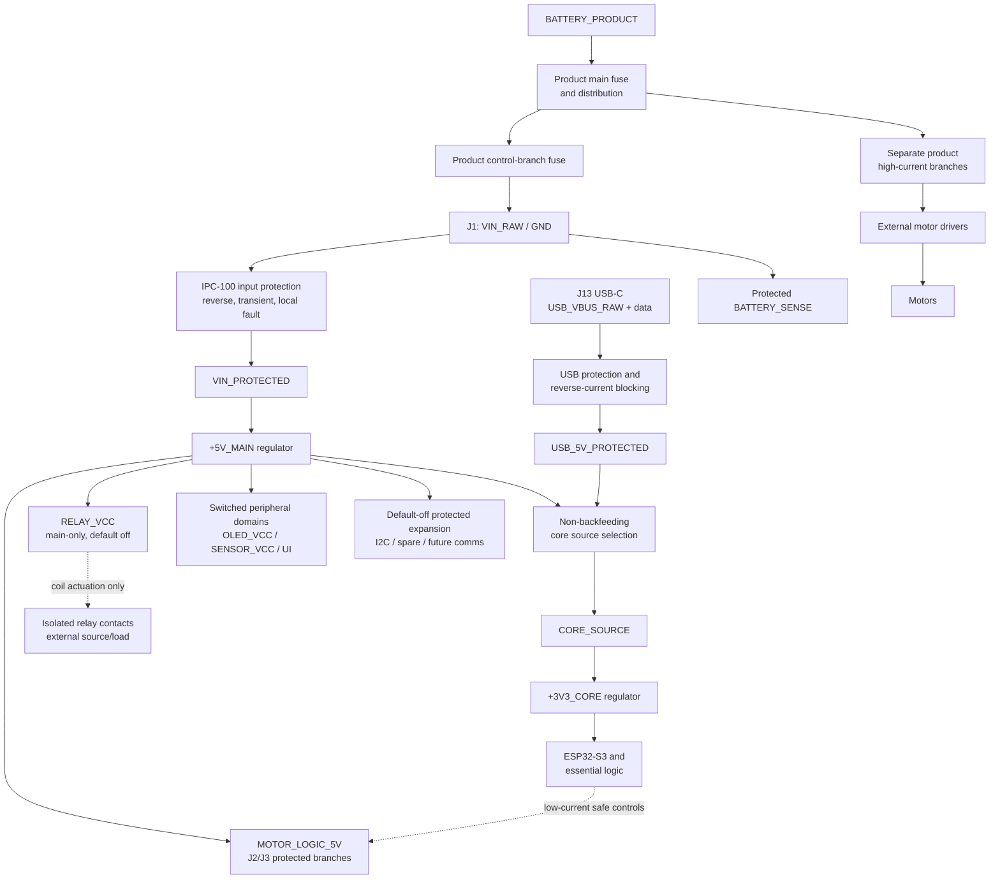

# IPC-100 Rev A Power Architecture Engineering Review

| Document control | Value |
| --- | --- |
| Platform | Iron Pine IPC-100 |
| Hardware revision | Rev A |
| Review scope | Block-level electrical power architecture |
| Date | 2026-07-29 |
| Status | Architecture review complete; component-level design not authorized |
| Owner | Iron Pine Outdoors Engineering |

## 1. Purpose

This review defines the complete block-level power architecture needed to enter controlled power-schematic design. It fixes ownership, domains, supported power states, source interaction, sequencing, protection objectives, fault containment, monitoring, and expansion policy without selecting components, values, footprints, or PCB implementation.

## 2. Scope and governing philosophy

IPC-100 is a low-current controller, not a battery manager, charger, high-current distributor, or motor-power path. Its power architecture shall:

- accept 9–21 V DC during normal operation at J1;
- keep product high-current energy outside the controller;
- separate source protection, core logic, field/interface loads, and isolated relay contacts;
- establish safe outputs in hardware before firmware runs;
- prevent backfeed among main power, USB, controller rails, and external equipment;
- preserve core safe-state behavior when an optional peripheral or accessory fails;
- support bounded USB-only programming, recovery, and diagnostics;
- expose enough monitoring and test access to validate every power state.

Normal-operation limits do not define transient-survival limits. Direct automotive charging-system connection and load-dump qualification remain outside Rev A unless separately approved.

## 3. Platform boundaries and power ownership

| Element | Owner | Architectural responsibility |
| --- | --- | --- |
| Battery cells, pack electronics, battery mount | Battery supplier / external product | Provide a compatible source and product-specific safe installation |
| Product main fuse | External product | Protect source and distribution near the battery |
| High-current branches and branch protection | External product | Feed motors, converters, drivers, and other product loads without traversing IPC-100 |
| IPC-100 control-branch fuse | External product | Protect the controller branch and harness upstream of J1 |
| J1 controller input | IPC-100 | Receive only controller `VIN_RAW` and `GND` |
| Local reverse-polarity and transient protection | IPC-100 | Prevent an approved input fault/transient from propagating into controller rails |
| Local board/rail overcurrent protection | IPC-100 | Protect PCB conductors, regulators, and limited power outputs |
| `+5V_MAIN` generation | IPC-100 | Supply approved main-powered controller and limited interface loads |
| `+3V3_CORE` generation/source selection | IPC-100 | Supply ESP32-S3 and essential logic from main power or bounded USB service power |
| Relay coil supply and driver energy | IPC-100 | Main-power-only, hardware-default-off coil path |
| Relay contact circuit power | External product or user accessory | Supply and fuse the isolated external circuit; IPC-100 contacts never source it |
| `OLED_VCC` | IPC-100 | Protected/switched peripheral domain; final voltage follows approved display |
| `SENSOR_VCC` | IPC-100 | Protected/switched peripheral domain; final voltage follows approved sensor |
| Motor-driver logic supply | IPC-100 only when explicitly budgeted | Limited main-power-only logic/interface power at J2/J3 |
| Motor-driver power stage | External motor driver / product | Consume product high-current power and contain power-stage faults |
| Motor current and motor power | External product | Never enter IPC-100 PCB or controller harness conductors |
| Expansion power | IPC-100 only for an approved limited output | Default-off, protected, budgeted accessory power; otherwise accessory self-power is product/user owned |
| USB host VBUS | USB host | Source service power within the USB contract |
| USB input protection/source selection | IPC-100 | Protect host and controller, prevent reverse current, and bound USB-only scope |
| External connector power pins | IPC-100 when labeled as controller outputs | Supply only the documented limited domain; connector loads remain within the approved envelope |
| Battery monitor | IPC-100 | Sense `VIN_RAW` through a protected high-impedance path; firmware reports controller-input voltage |
| Accessory internal power and faults | User accessory / external product | Stay within the released connector contract and not backfeed IPC-100 |

The product shall not rely on IPC-100 local protection as the battery main fuse or high-current branch protection.

## 4. Defined power domains

| Domain | Purpose and source | Consumers | Isolation / protection expectation | Shutdown and fault behavior |
| --- | --- | --- | --- | --- |
| `BATTERY_PRODUCT` | Product battery domain before distribution | Product distribution | Battery/product protection; outside IPC-100 | Product-defined |
| `PRODUCT_CONTROL_BRANCH` | Separately fused branch from product distribution | J1 harness | Product control-branch fuse and wiring protection | Removal turns off main-powered IPC-100 domains |
| `VIN_RAW` | 9–21 V normal input at J1 | Local protection and battery-sense front end | No other connector may source it; reverse/transient/ESD boundary follows J1 | Invalid input shall not reach regulated rails unsafely |
| `VIN_PROTECTED` | Main input after local reverse-polarity, transient, and input-fault protection | Main regulation only | Contained from raw-input faults; locally testable | Collapses on removed/rejected input |
| `+5V_MAIN` | Primary regulated main-power rail from `VIN_PROTECTED` | Relay coil path, approved 5 V loads, motor-driver logic outputs, main side of core source selector | Current-limited at source; branch protection/fault containment for external outputs | Off under USB-only; controlled collapse shall not pulse outputs |
| `USB_VBUS_RAW` | 5 V nominal from J13 host | USB input-protection block only | ESD/fault protection; never connected directly to `+5V_MAIN` or J1 | Disconnect removes USB contribution without disturbing valid main power |
| `USB_5V_PROTECTED` | Protected and current-bounded USB service source | Core source selector and VBUS presence sensing | Reverse-current blocked toward host; no battery charging path | Off on USB removal/fault; cannot energize main-only loads |
| `CORE_SOURCE` | Selected non-backfeeding source from `+5V_MAIN` or `USB_5V_PROTECTED` | `+3V3_CORE` regulator | Source arbitration prevents cross-feed in all connection orders | Maintains core while either valid source remains |
| `+3V3_CORE` | Secondary regulated essential-logic rail | ESP32-S3, required core logic, supervision, protected logic-side interfaces | Highest priority rail; external injection blocked; rail fault may reset/hold core off | Brownout/reset below valid operating range; outputs remain hardware safe |
| `RELAY_VCC` | Main-power-only branch from `+5V_MAIN` | Relay coil/driver only | Driver isolation from GPIO, flyback/transient containment, local fault containment | De-energized whenever main rail invalid; `RELAY_NO` open |
| `OLED_VCC` | Switched peripheral branch from approved 3.3 V or 5 V source | Approved OLED only | Off by default; current/fault containment appropriate to connector exposure | Off in USB-only and before safe initialization; failure nonessential |
| `SENSOR_VCC` | Switched peripheral branch from approved 3.3 V or 5 V source | Approved environmental sensor only | Off by default; current/fault containment appropriate to connector exposure | Off in USB-only and before safe initialization; failure nonessential |
| `MOTOR_LOGIC_5V` | Limited, protected main-power-only branches from `+5V_MAIN` | J2/J3 external driver logic only | Separate per-interface fault containment preferred; no motor current; reverse injection blocked | Off in USB-only/brownout; commands and enables inactive before and during collapse |
| `UI_ACCESSORY_VCC` | Limited switched rail(s) derived from approved main rail | J8 controls/indicators if powered by IPC-100 | Connector-specific current limiting and backfeed prevention | Default off until safe-state establishment unless passive inputs require otherwise |
| `I2C_EXP_VCC` | Optional switched, protected expansion power | J10 approved local I2C accessory | Default off; bounded current; fault shall not collapse core or block safe startup | Off in USB-only and on expansion fault |
| `SPARE_EXP_VCC` | Reserved optional domain | J11/daughterboard only if later approved | No guaranteed Rev A voltage/current; no connection until contract exists | Unpowered by default |
| `FUTURE_COMMS_VCC` | Reserved future domain | CAN/RS485 transceivers or module | Not populated/released in Rev A; future fault containment required | No Rev A behavior claim |
| `BATTERY_SENSE` | Protected measurement signal derived from `VIN_RAW` | Approved ADC path | High impedance, filtered, injection-limited, valid with main input only | Must not phantom-power core; reports invalid/unavailable when main absent |
| `RELAY_CONTACT_EXTERNAL` | Product/user source isolated from controller power | External load through NC/COM/NO | Galvanic separation and ratings defined during component design | Passive contact state only; no platform-assigned meaning for NC |
| `GND_LOGIC` | IPC-100 low-current reference | Controller and approved logic interfaces | Motor current excluded; USB shield/chassis coupling separately defined | Reference remains common where interface contract requires it |
| Reserved future rails | No Rev A source | Future modules only | No uncommitted copper/power promise | Remain unpowered until a future controlled revision |

`OLED_VCC` and `SENSOR_VCC` are defined as separately controlled domains without prematurely assigning their voltages. Their exact source voltage is a pre-schematic peripheral-selection decision.

## 5. Block-level power tree

Dashed paths are control or isolation relationships, not shared load-power paths.

## 6. Supported operating states

| State / event | Powered domains and expected behavior |
| --- | --- |
| Power Off | No valid main or USB source. All regulated and switched rails off. Relay de-energized; motor commands/enables, RGB, and buzzer hardware-inactive. No external interface may phantom-power a rail. |
| Main Power Only | Valid J1 input produces `VIN_PROTECTED`, `+5V_MAIN`, `CORE_SOURCE`, and `+3V3_CORE`. Core boots safely; main-only peripheral/interface rails remain off until sequenced. |
| USB Only | `USB_5V_PROTECTED`, `CORE_SOURCE`, and `+3V3_CORE` may power the ESP32-S3 service/recovery domain. `+5V_MAIN`, relay, motor-driver logic power, OLED, sensor, UI-accessory, and expansion power remain off. Firmware enters bounded service mode and shall not claim product readiness. |
| USB + Main Power | Source selector feeds the core without cross-current. Main power owns all main-only loads; USB provides data and may remain an alternate core source. Connection/removal order shall not reset the controller when the remaining source is valid unless the final source-selection implementation cannot meet this objective and the limitation is approved. |
| Brownout | Hardware supervision holds/resets the processor before code execution becomes unreliable. Relay and motor outputs remain inactive independent of firmware. Nonessential switched loads are removed first where supported. Recovery requires stable valid rails and a clean restart. |
| Undervoltage at J1 | Below the approved operating threshold, main-power outputs are disabled and main operation is rejected. USB service may remain available if connected. No rapid cycling or output pulses are permitted. Numeric thresholds/hysteresis remain component-design inputs. |
| Overvoltage at J1 | Input protection/regulation shall reject, clamp, limit, or safely stop operation within the approved profile. Unsafe regulated-rail rise is prohibited. Damage beyond the approved survival profile is not claimed. |
| Reverse polarity | Local input architecture blocks downstream reverse voltage/current within the approved condition. Controller remains off and shall not heat unsafely. Product fuse coordination remains product-owned. |
| Processor reset | Core rail may remain valid. Hardware keeps relay and motor interfaces inactive; peripheral/expansion rails return to their default-off or safe condition. Firmware repeats ordered initialization. |
| Watchdog reset | Same hardware response as processor reset. Reset cause is retained/reported where supported; outputs require revalidation before re-enable. |
| Unexpected power loss | Hardware safe states persist throughout rail decay. No relay chatter, motor command pulse, GPIO backfeed, or misleading powered indication is permitted. |
| Battery removal | Equivalent to main-power loss. If USB is absent, full power-off follows; if USB is present, transition to bounded USB-only service mode without main-powered outputs. |
| USB disconnect | Main-powered operation continues without disturbance when main power is valid. Under USB-only, core shuts down safely and all outputs were already unavailable. |
| Externally powered accessory while IPC-100 is off | Accessory power shall be blocked from all controller rails and USB. Interface pins tolerate or isolate only the approved external condition; unsupported power must not be applied. |
| Accessory unplugged | Core and safe outputs continue. The affected protected branch may report absence/fault. I2C or optional-device timeouts shall not block safety initialization. |

Unsupported states, including applying power outside released connector limits, have no guaranteed functional behavior but shall be considered in foreseeable-miswiring analysis during schematic design.

## 7. Protection philosophy

| Hazard | Required architectural response |
| --- | --- |
| Input reverse polarity | Series blocking or controlled reverse-protection stage before `VIN_PROTECTED`; no downstream reverse bias |
| Main fuse / controller fuse | Product main and controller-branch fuses upstream; IPC-100 local protection supplements rather than replaces them |
| Input surge/transient | Defined energy path at J1, coordinated with input impedance, reverse protection, regulation, and ground; exact profile required before parts |
| ESD | Protection at every externally accessible power/data entry with return paths that avoid core logic and analog sense routing |
| Short circuit / overcurrent | Source current limiting plus branch containment for external supply outputs; one accessory fault shall not collapse `+3V3_CORE` or create unsafe outputs |
| Backfeed | Reverse-current blocking at USB, main/core source selector, powered external connectors, signal interfaces, and unpowered peripherals |
| Undervoltage/brownout | Regulator UV behavior plus processor supervision and hardware output gating; hysteresis/debounce prevent chatter |
| Ground reference fault | Low-current interface returns are not motor returns; connector contracts define reference ownership; no motor current through PCB |
| USB fault | Bound VBUS current, block reverse current to host, protect data/connector entry, keep main outputs independent |
| Accessory/expansion fault | Default-off protected branch, bounded fault energy, diagnostic isolation, safe core startup preserved |
| Motor-driver fault | External high-current protection is product-owned; IPC-100 logic paths block injection and remain hardware inactive when controller power is invalid |
| Relay coil fault | Coil branch fault contained from core; driver defaults off; coil transient contained locally |
| Relay-contact fault | External source/fuse/load remain product-owned; contact fault shall not bridge the isolation boundary within approved ratings |

Protection parts, ratings, coordination, and exact single-fault coverage belong to schematic and component reviews.

## 8. Monitoring philosophy

IPC-100 shall provide:

- `BATTERY_SENSE` measurement of J1 `VIN_RAW`, not battery state-of-charge certification;
- processor brownout/reset-cause visibility where supported;
- test access to `VIN_RAW`, `VIN_PROTECTED`, `+5V_MAIN`, `USB_5V_PROTECTED`, `CORE_SOURCE`, `+3V3_CORE`, `GND_LOGIC`, and `BATTERY_SENSE`;
- regulator enable/power-good and protected-branch fault access when the selected architecture provides them;
- firmware diagnostics for source presence, invalid battery measurement, reset cause, and detectable rail/accessory faults.

Battery accuracy, divider path, ADC input, calibration, thresholds, sampling, and reporting remain open. Monitoring shall not be the only mechanism enforcing safe output states.

## 9. Power sequencing and initialization

1. Input and USB protection remain passive-safe before any regulated rail exists.
2. A valid source establishes `CORE_SOURCE`, then `+3V3_CORE`.
3. Hardware bias/gating holds relay control, motor commands/enables, RGB, buzzer, and switched peripheral/expansion enables inactive throughout rail rise.
4. ESP32-S3 exits reset only after its rail and boot conditions are valid.
5. Firmware records reset/source state and establishes hardware abstractions without enabling external power.
6. STOP and limit inputs are initialized and validated before controllable outputs.
7. Main-source validity is confirmed. USB-only operation remains in service mode.
8. Required onboard peripheral rails may be enabled one at a time, with settling and fault checks.
9. External UI, motor-driver logic supplies, and approved expansion power are enabled only after their contracts and safe-state controls are valid.
10. Relay and motor commands remain disabled until platform and product authorization conditions are satisfied.

Shutdown reverses functional priority: commands are disabled first, relay de-energizes, external/switched loads turn off, then core power may decay. Hardware must preserve that result when shutdown is uncontrolled and firmware cannot run.

## 10. Failure-mode allocation

| Failure | Hardware response | Firmware response | Product/external responsibility | Safe state |
| --- | --- | --- | --- | --- |
| Reverse polarity | Block downstream power | None possible | Correct wiring and upstream fuse | Controller off |
| Input overvoltage/transient | Contain/reject within approved profile | Log if core survives and detection exists | Source compatibility | No unsafe rail rise/output |
| Main undervoltage/brownout | Gate outputs; reset/hold core as required | Warn before reset if time permits; clean reinitialize | Battery/source maintenance | Relay off, motors disabled |
| Processor crash | Hardware output defaults persist; watchdog may reset | Recovery after watchdog | Product handles interrupted operation | Relay off, motors disabled |
| Watchdog reset | Same as reset | Record cause and require reauthorization | Product recovery workflow | Outputs inactive |
| USB short/fault | Limit/isolate USB path | Report if main-powered core remains | Host/cable integrity | Main operation safe or controlled reset |
| OLED short/failure | Isolate/switch off peripheral branch | Disable display and report | Product UI fallback | Core control remains safe |
| Sensor short/failure | Isolate/switch off peripheral branch | Mark data invalid and report | Product shall not rely on invalid data | Core control remains safe |
| Low battery | Hardware follows approved UV/brownout thresholds | Report measured low input and inhibit per product policy | Product defines user action and battery limits | No uncontrolled output |
| Battery removed | Main rails collapse safely; USB may retain service core | Detect source loss if possible | Product mechanics/source | Main outputs off |
| Relay coil/driver fault | Contain branch; default drive off | Detect/report if supported | Product validates external load circuit | Coil de-energized where physically possible |
| Welded relay contact | Hardware cannot guarantee opening after weld | Report only if feedback exists | Product hazard analysis and load protection | Product mitigation required |
| Motor-driver fault | Block injection; disable commands | Detect/report available status; stop commands | Driver/product handles motor energy | Controller commands inactive |
| External supply short | Branch limiting/containment | Disable affected branch and report | Accessory within contract | Core stays operational and safe |
| Expansion overload | Remove/limit expansion power | Quarantine expansion and report | Accessory compliance | Core and safety inputs remain available |
| External back-power attempt | Reverse blocking/isolated interface | Report if detectable | Accessory must obey contract | IPC-100 rails not energized |
| Unexpected power loss | Passive safe-state controls during decay | None guaranteed | Product handles interrupted operation | Relay off, motors disabled |

A welded relay, shorted output transistor, or fault beyond approved ratings may require product-level independent risk controls. IPC-100 is not claimed as a certified safety controller.

## 11. Power-budget review

### 11.1 Confidence classification

| Load group | Knowledge | Confidence | Required closure |
| --- | --- | --- | --- |
| ESP32-S3 module functions | Candidate family known; exact variant and radio workload unknown | Low | Datasheet maxima, firmware workload, bench transient profile |
| Core logic/input conditioning | Functions known; circuit topology absent | Low | Schematic-derived load model |
| Relay coil/driver | Functional need known; relay not selected | Low | Coil voltage/current/duty and driver losses |
| Motor-driver logic x2 | Connector role known; compatible external driver contract unresolved | Low | Per-interface static/peak/backfeed envelope |
| OLED | Reference function known; exact module/domain/modes unknown | Low | Approved module startup/active/sleep data |
| Environmental sensor | Reference function known; exact module/domain/mode unknown | Low | Approved sensor mode and current data |
| RGB and buzzer | Functions known; topology/brightness/acoustics unknown | Low | Approved load and simultaneous-use envelope |
| USB service | USB-only scope now defined; implementation losses unknown | Medium architecture / Low numeric | Source-selection and regulator load model |
| Expansion | Optional and default-off policy defined; capacity unallocated | High policy / Low numeric | Explicit per-connector reserves or no-power disposition |
| Motors/high-current driver stages | Explicitly external | High boundary | Product-owned budget |
| Relay-contact external load | Explicitly external | High boundary | Product-owned budget |

No numeric load may be invented. The existing preliminary 2.0 A controller-input-path target at 9 V remains a study target, not a derived load, regulator rating, fuse value, or released capacity.

### 11.2 Required measurements and margins

Component selection shall produce worst-case typical, peak, startup, fault-limited, and simultaneous-load values for each rail. Prototype validation shall capture radio bursts, rail droop, inrush, relay actuation, peripheral startup, source switchover, brownout, and external-output faults with adequate bandwidth.

Reserve is allocated only after required worst-case loads, conversion loss, temperature derating, tolerance, and transient response are closed. Rev A has no guaranteed general expansion wattage. Unallocated capacity remains design margin, not accessory entitlement.

## 12. USB-C service power architecture

- J13 is a USB-C device/service port using ESP32-S3 native USB Serial/JTAG data.
- IPC-100 is not a USB host, USB Power Delivery sink, battery charger, or source of VBUS in Rev A.
- Default USB power is nominal USB VBUS under the basic device-current contract; higher negotiated power is not assumed.
- USB data and VBUS receive connector-entry protection; shield/chassis coupling remains a PCB/mechanical decision.
- `USB_5V_PROTECTED` feeds only the non-backfeeding core source selector.
- USB-only service powers `+3V3_CORE` and the minimum circuitry needed for programming, console, JTAG, reset, and recovery.
- Main-only loads and all externally exposed supply outputs remain off during USB-only service.
- Simultaneous main and USB power shall not cross-charge, backfeed the host, energize J1, or charge the product battery.
- Ground reference is shared for USB data and controller logic; motor/high-current return current remains excluded.
- Recovery access includes documented boot/reset controls and a UART/test path if required by final service validation.
- A USB fault shall be contained from valid main power to the extent supported by the selected source architecture.

## 13. Expansion power philosophy

Rev A expansion is optional, nonessential to safe startup, and receives power only through a released connector contract.

- J10 I2C power is default-off, protected, current-bounded, and enabled after core safety initialization.
- J11 has no guaranteed power until its function and pin count are approved.
- Future CAN and RS485 transceivers use a separately reviewed future domain; no Rev A field-bus power is promised.
- Daughterboards require identification, voltage/current limits, sequencing, grounding, backfeed blocking, mechanical retention, and revision compatibility.
- Hot plug is **not supported by default**. An interface may claim hot-plug only after connector, inrush, ESD, bus-state, and fault-recovery validation.
- Self-powered accessories shall not inject power through supply, data, pull-up, protection, or GPIO paths.
- An expansion fault shall be removable or isolatable without defeating STOP/limits, core diagnostics, or hardware-safe outputs.
- Future rail capacity must be explicitly allocated; unused Rev A regulator margin is not a released accessory budget.

## 14. Remaining engineering decisions

| Stage | Decision |
| --- | --- |
| Before schematic | Approve transient/reverse/undervoltage/overvoltage input profiles and upstream fuse assumptions |
| Before schematic | Approve exact ESP32-S3 module variant and its worst-case power modes |
| Before schematic | Approve 5 V and 3.3 V load envelopes, source priorities, reserve policy, and thermal objectives |
| Before schematic | Approve final OLED/sensor devices and whether each switched domain is 3.3 V or 5 V |
| Before schematic | Approve motor-driver logic, relay-coil, RGB, buzzer, J8, and J10 electrical load envelopes |
| Before schematic | Approve J11 no-power/defined-power disposition and USB source-transition continuity requirement |
| During schematic | Choose protection, regulation, source-selection, branch-limiting, supervision, and driver topologies/components |
| During schematic | Define numeric UV/brownout/OV thresholds, hysteresis, sequencing delays, inrush, and current limits |
| During schematic | Define battery-sense ADC path, range, accuracy, impedance, filtering, and calibration |
| During schematic | Define all test points, power-good/fault signals, passive output defaults, and discharge paths |
| Before PCB | Approve grounding, USB shield/chassis treatment, high-di/dt loops, thermal paths, connector-entry protection placement, and analog routing |
| Before prototype | Release worst-case rail budget, thermal analysis, fault analysis, and controlled bring-up/measurement plan |
| Future revision | Allocate powered CAN/RS485/daughterboard domains or USB host/PD/charging features if required |

## 15. Schematic-entry checklist

| Criterion | Status | Evidence / blocker |
| --- | --- | --- |
| Platform/product/battery/motor ownership | Satisfied | Sections 2–3 |
| Complete block-level power tree | Satisfied | Section 5 |
| Main, USB, core, peripheral, interface, and future domains | Satisfied | Section 4 |
| Supported operating states | Satisfied | Section 6 |
| USB-only and simultaneous-source behavior | Satisfied | Sections 6 and 12 |
| Backfeed boundaries | Satisfied at architecture level | Component realization and fault ratings remain during schematic |
| Startup/shutdown priority and safe defaults | Satisfied at architecture level | Numeric timing and circuits remain during schematic |
| Protection objectives and ownership | Satisfied at architecture level | Input profiles and component coordination remain open |
| Failure allocation | Satisfied at architecture level | Component single-fault analysis remains during schematic |
| Expansion power philosophy | Satisfied | Section 13 |
| Regulator/source-selection topology | Partially Satisfied | Functional blocks fixed; implementation topology/components open |
| Numeric load envelopes and reserve | Not Satisfied | Required devices and external interface loads unselected |
| Input transient and abnormal-voltage profiles | Not Satisfied | Required before protection component selection |
| `OLED_VCC` and `SENSOR_VCC` voltage selection | Not Satisfied | Exact peripherals unapproved |
| Relay and motor-driver logic supply contracts | Partially Satisfied | Ownership/domain fixed; electrical loads/limits open |
| USB protection and source-transition implementation | Partially Satisfied | Behavior fixed; circuit and acceptance criteria open |
| Battery-monitor implementation | Partially Satisfied | Ownership/source fixed; ADC/range/accuracy open |
| Connector power-pin release | Not Satisfied | J8/J10/J11 limits and connector architecture open |
| Measurement points | Partially Satisfied | Required nodes defined; schematic access implementation open |
| Ground/return strategy | Partially Satisfied | Current ownership fixed; PCB/shield details open |
| Rail sequencing implementation | Partially Satisfied | Order fixed; enable/discharge/timing implementation open |

## 16. Schematic readiness and next actions

**Power architecture maturity:** Block architecture complete; quantitative electrical design inputs incomplete.  
**Power-package readiness:** Ready to begin the next power engineering package, not ready to release a power schematic.  
**Overall IPC-100 schematic readiness:** Not ready.

The recommended next package is **Rev A Power Requirements and Component Selection Inputs**: approve abnormal-input profiles, exact powered loads, worst-case rail budgets, peripheral voltage domains, external-interface envelopes, source-transition acceptance criteria, and thermal/environmental targets. That package enables controlled selection of protection, regulation, source arbitration, supervision, and interface-power components.

## 17. Files reviewed

- `README.md`
- `docs/architecture/System_Architecture.md`
- `docs/architecture/Processor_Selection_Study.md`
- `docs/architecture/Processor_Resource_Feasibility.md`
- `docs/requirements/Hardware_Requirements.md`
- `docs/requirements/Functional_Requirements.md`
- `docs/power/Power_Architecture.md`
- `docs/power/Power_Budget.md`
- `docs/connectors/Connector_Specification.md`
- `docs/connectors/Connector_Architecture_Review.md`
- `docs/revisions/Open_Design_Items.md`
- `docs/revisions/Revision_History.md`
- `docs/revisions/Schematic_Readiness_Review_Rev_A.md`
- `docs/architecture/Design_Decisions.md`
- `firmware/README.md`

## 18. Related documents

- [Power Architecture](Power_Architecture.md)
- [Power Budget](Power_Budget.md)
- [System Architecture](../architecture/System_Architecture.md)
- [Hardware Requirements](../requirements/Hardware_Requirements.md)
- [Connector Specification](../connectors/Connector_Specification.md)
- [Schematic Readiness Review](../revisions/Schematic_Readiness_Review_Rev_A.md)
