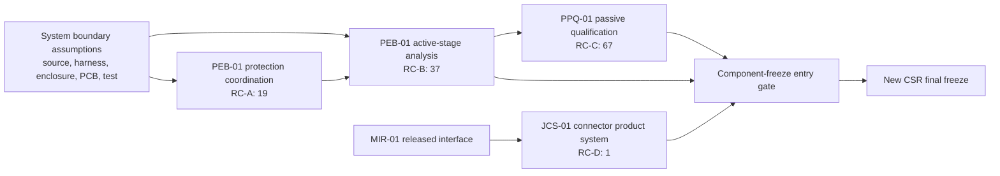

# DRA-01 — Design Readiness Assessment

| Field | Result |
|---|---|
| Platform | IPC-100 Rev A |
| Assessment date | 2026-07-31 |
| Baseline | CSR-01A-R3 commit `13de018` |
| Power rows reviewed | 133 |
| Frozen | 9 |
| Blocked | 124 |
| Root causes | 4 |
| Schematic changes | None |

## Executive Summary

CSR-01A-R3 failed for a process-level reason: the project advanced from architecture and functional capture directly into final component freeze without first releasing a controlled **power design evidence baseline**. The remaining blockers are not predominantly schematic defects. They are missing system boundary assumptions, coupled analytical results, manufacturer-curve qualification, and one incomplete connector product definition.

Every blocked component maps to exactly one of four root causes:

1. protection/transient coordination evidence absent — 19 rows;
2. active power-stage analytical and physical closure absent — 37 rows;
3. dependent passive qualification evidence absent — 67 rows;
4. J1 connector system order-code definition absent — 1 row.

ECO-001 through ECO-007 appropriately corrected implementation defects, but an ECO cannot supply enclosure temperature, PCB copper, source impedance, harness parasitics, vendor-tool results, capacitor bias curves, thermal models, lifecycle evidence, or complete connector order codes. Repeating CSR now would reproduce the same result.

The recommended next package is **PEB-01 — Power Evidence Baseline and Analytical Closure**. It establishes the system assumptions and calculations that gate 56 protection/active rows and make the 67-row passive qualification package technically determinate.

## Blocked Component Statistics

| Root cause | Rows | Share of blocked population |
|---|---:|---:|
| RC-A — Protection and transient coordination model absent | 19 | 15.3% |
| RC-B — Active power-stage analytical/physical closure absent | 37 | 29.8% |
| RC-C — Dependent passive qualification evidence absent | 67 | 54.0% |
| RC-D — J1 product-system definition absent | 1 | 0.8% |
| **Total** | **124** | **100%** |

The nine frozen rows are low-energy 100 kΩ bias resistors whose requirements were independent of the missing power-stage models. Their successful freeze does not indicate broader component readiness.

## Root Cause Tree

```text
CSR-01A-R3 NOT ACCEPTED — 124 blocked
├─ RC-A: protection/transient coordination model absent — 19
│  ├─ missing source impedance and pulse envelopes
│  ├─ missing harness/filter parasitics and fault-energy model
│  └─ missing clamp/fuse/eFuse/downstream-abs-max coordination
├─ RC-B: active power-stage analytical/physical closure absent — 37
│  ├─ exact suffix and vendor-tool models not released
│  ├─ loop, loss, current-limit, SOA and tolerance work incomplete
│  └─ PCB copper, enclosure ambient and thermal boundary undefined
├─ RC-C: dependent passive qualification evidence absent — 67
│  ├─ capacitor DC-bias/ripple/ESR/aging evidence missing
│  └─ resistor tolerance/voltage/pulse/failure-effect evidence missing
└─ RC-D: J1 product-system definition absent — 1
   └─ housing, mate, terminals, seals, wire, strain relief and tooling open
```

### RC-A — Protection and transient coordination model absent

**Affected references (19):** D101, D102, D103, D104, F101, Q102, D201, D202, D203, D204, D205, D206, D207, D208, D209, D210, D803, FB801, D902.

**Required evidence:** authoritative input/USB/external-line source models; pulse amplitude, duration, repetition and source impedance; harness inductance/resistance; filter impedance; TVS tolerance/dynamic resistance/clamp; fuse/eFuse trip and I²t; diode leakage/capacitance; fault energy; downstream absolute-maximum and recovery proof; temperature and aging margins.

**Root cause rather than symptom:** individual protection parts cannot be selected independently because their stress and clamp performance are defined by the same unresolved source/harness/load model.

**Corrective package:** PEB-01.

### RC-B — Active power-stage analytical and physical closure absent

**Affected references (37):** C102, C103, C104, C109, L101, Q101, U101, U102, C202, C205, C210, L201, L202, R201, R222, R223, R224, U201, U202, U203, U204, U205, U206, U207, U208, U209, U210, U211, U212, U213, U302, U706, U707, C804, R806, R808, U801.

**Required evidence:** exact functional suffix candidates; package-independent pin/function equivalence; manufacturer design-tool and loop analysis; frequency/current-limit/tolerance stacks; dropout/headroom and partial-power behavior; inrush and reverse-current behavior; SOA and transient thermal calculations; enclosure ambient; PCB layer/copper/via assumptions; junction estimates; lifecycle/source/alternate strategy; defined prototype measurements where simulation cannot close uncertainty.

**Root cause rather than symptom:** these devices and directly coupled programming/energy-storage parts share models. Freezing one before the conversion/protection/thermal analysis is released creates circular rework.

**Corrective package:** PEB-01.

### RC-C — Dependent passive qualification evidence absent

**Affected references (67):** C101, C105, C106, C107, C108, R101, R102, R103, R104, R105, R106, R107, R108, R109, R110, R111, R112, R113, R114, R115, R116, C201, C203, C204, C206, C207, C208, C209, C211, C212, C213, C214, C215, C216, C217, C218, C219, C220, C221, R202, R203, R205, R206, R207, R208, R209, R210, R211, R213, R215, R217, R225, R226, R227, R228, R229, R230, R231, C305, C306, C702, C703, C704, C705, R704, R705, C802.

**Required evidence:** function-specific minimum/maximum values; DC-bias curves; dielectric and aging; ESR/ripple and stability range; resistor tolerance/tempco; working and overload voltage; pulse energy; dissipation; threshold/output error; failure consequence; lifecycle, source, alternate and cost evidence.

**Root cause rather than symptom:** the generic inventory generator classified passives by reference type, but the project has not released function-specific passive requirement tables derived from the active-stage calculations. Manufacturer selection is consequently underconstrained.

**Corrective package:** PPQ-01, after PEB-01.

### RC-D — J1 connector system definition absent

**Affected reference (1):** J1.

**Required evidence:** exact controller and cable housings, mate, terminals, seals, backshell/strain relief, wire range, current/voltage/contact resistance, locking/keying, environmental rating, mating cycles, tooling, field replacement, lifecycle, sourcing and alternate strategy.

**Root cause rather than symptom:** MIR-01 froze the interface and mechanical envelope but intentionally did not select the complete procurement system.

**Corrective package:** JCS-01, parallel with PEB-01.

## Dependency Graph



The smallest dependency graph has three work branches. PEB-01 is the critical path. PPQ-01 cannot complete before PEB-01 because capacitor, inductor, divider, timing, and programming requirements depend on the selected operating models. JCS-01 can proceed in parallel. A new CSR is justified only after all three branches produce controlled evidence.

## Readiness Assessment

- **Architecture is not the blocker.** Rail ownership, safety ownership, hierarchy, GPIO, and external contracts are stable.
- **Functional schematic implementation is not the dominant blocker.** ECO-007 closed the last known datasheet-level circuit incompatibilities.
- **Analysis release is the bottleneck.** Calculations are distributed across ECO/review prose and provisional schematic values rather than a controlled, dependency-ordered design evidence package.
- **Physical assumptions are premature or absent.** Power IC thermal feasibility needs PCB copper/layers/vias and enclosure ambient, yet footprint/layout work is gated. Package-independent thermal envelopes must be released before footprint assignment.
- **Prototype validation is undefined.** No controlled list separates calculations that must close analytically from measurements that can legitimately remain prototype gates.
- **Commercial selection is downstream.** Lifecycle, sources, alternates and prices should be evaluated after electrical/package envelopes are stable, not used to compensate for missing requirements.

## Engineering Maturity Matrix

| Domain | Maturity | Basis |
|---|---|---|
| Power architecture | Engineering Complete | QER/ADRs and power tree are frozen; no ownership changes indicated |
| Power calculations | Preliminary | Key nominal calculations exist, but tolerance, vendor-tool, loss, stability and boundary models are incomplete |
| Protection | Preliminary | Topology/classes exist; coordinated source-to-load stress proof is absent |
| Regulators | Preliminary | Candidate families and corrected programming exist; exact suffix/thermal/stability closure absent |
| Passives | Preliminary | Nominal values/classes exist; manufacturer-curve and function-specific qualification absent |
| Connectors | Preliminary | Interface contracts and J1 envelope released; complete J1 product system absent |
| Mechanical interfaces | Engineering Complete | MIR-01 and ICD contracts define interfaces; production hardware selection still pending |
| Manufacturing | Concept | Footprints, DFM, assembly constraints, tooling and production evidence intentionally deferred |
| Prototype readiness | Preliminary | Functional capture is testable in principle, but test methods, thermal articles and procurement BOM are incomplete |
| Component readiness | Preliminary | 9 of 133 power rows frozen; 124 remain blocked |

No assessed domain is Production Ready. Manufacturing is Concept because the authorized project state intentionally contains zero footprints and no PCB implementation.

## Minimum Corrective Package Set

| Rank | Package | Scope | Direct population addressed | Return on effort |
|---:|---|---|---:|---|
| 1 | **PEB-01 — Power Evidence Baseline and Analytical Closure** | Freeze source/harness/enclosure/PCB/test assumptions; close transient coordination and active-stage calculations; define package-independent thermal envelopes and permitted prototype tests | 56 rows (RC-A + RC-B), and unlocks RC-C | Highest; removes the critical-path ambiguity behind 123 rows |
| 2 | **PPQ-01 — Power Passive Qualification** | Select/qualify capacitors, resistors and remaining dependent passives against PEB-01 requirements and manufacturer curves | 67 rows | Highest row count, but cannot start conclusively before PEB-01 |
| 3 | **JCS-01 — J1 Connector System Definition** | Complete housing/mate/contact/seal/wire/tooling/lifecycle/source/alternate selection under MIR-01 | 1 row | Small direct count; independent and suitable for parallel execution |

These are evidence/selection packages, not ECOs. If PEB-01 or PPQ-01 exposes a topology/value incompatibility, that specific defect should trigger a narrow ECO. No architecture package is presently indicated.

## Recommended Sequence

1. Launch **PEB-01** first. Release a single calculation index, assumption register, load/source cases, thermal boundary, and verification matrix.
2. Launch **JCS-01** in parallel because it depends only on MIR-01 and released interface requirements.
3. Start **PPQ-01** only after PEB-01 freezes the electrical and thermal envelopes used to select passives.
4. Run a readiness gate confirming all 124 blocker records have closure evidence and no new schematic incompatibility exists.
5. Only then authorize a new CSR final power freeze. Do not run another CSR immediately after DRA-01.

## Risk Assessment

| Risk | Severity | Evidence | Control |
|---|---|---|---|
| Another premature CSR repeats the 9/124 result | High | Three failed freeze attempts with nearly unchanged evidence population | Enforce PEB-01/PPQ-01/JCS-01 exit criteria before CSR entry |
| Protection parts selected without a common source model | Critical | 19 coordinated rows share generic transient blockers | One end-to-end transient model in PEB-01 |
| Thermal feasibility deferred until after footprint choice | High | Active rows cite unknown copper/enclosure assumptions | Release package-independent copper/layer/via envelope in PEB-01 |
| Passive selection churn | High | 67 rows depend on active-stage/tolerance calculations | Sequence PPQ-01 after analytical closure |
| Prototype deferral hides design uncertainty | High | No controlled validation-vs-analysis split | PEB-01 verification matrix with measurable pass/fail limits |
| Connector procurement remains impossible | Medium | MIR-01 has no complete order-code chain | JCS-01 in parallel |
| Sourcing work ages before electrical closure | Medium | Stock/pricing are time-sensitive | Perform commercial refresh at the end of each selection package |

## Validation

- Reconciled all 133 power rows from the canonical EBOM.
- Confirmed 9 `FROZEN` and 124 `BLOCKED` rows.
- Assigned every blocked row to exactly one root cause: 19 + 37 + 67 + 1 = 124.
- Confirmed no duplicate or stale reference through existing inventory/hierarchy validators.
- Cross-checked blocker categories against CSR-01A, CSR-01A-R, CSR-01A-R2, CSR-01A-R3, ECO-006, ECO-007, QER-01 and MIR-01.
- Made no schematic, ADR, ICD, footprint, PCB, EBOM selection, or AVL selection change.
- Native ERC is outside this diagnostic package and remains pending from prior reviews because `kicad-cli` is unavailable.

## Final Decision

# DRA-01 COMPLETE

Recommended next corrective package: **PEB-01 — Power Evidence Baseline and Analytical Closure**.
